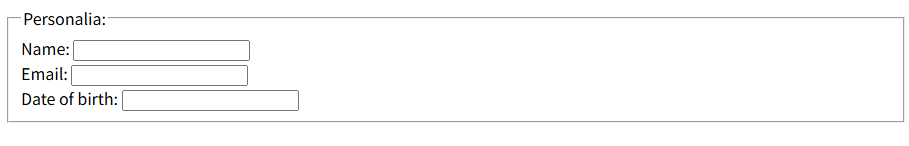

# Web Programming
跨域：协议 域名 端口任一不同就是跨域
协议
域名
端口

一个完整的URL通常包括以下部分：
   - **协议（Protocol）**：如`http://`或`https://`
   - **主机名（Hostname）**：如`example.com`
   - **端口（Port）**：可选，如`:8080`
   - **路径（Path）**：如`/api/users`
   - **查询参数（Query Parameters）**：可选，如`?id=123&name=foo`
   - **片段（Fragment）**：可选，如`#section1`（通常用于前端页面锚点，不会发送到服务器）

URL:统一资源定位符，用于定位互联网上的资源，如：http://www.example.com/index.html 俗称网络地址，简称网址
可以是服务器上的一个物理文件、动态生成的内容或者一个API端点(endpoint)

当服务器收到一个请求时，它会根据请求的URL路径和请求方法（GET、POST等）来决定由哪个处理程序（handler）来处理这个请求。这个过程称为路由（routing）。

- 如果URL指向的是静态文件目录中的文件，那么它对应服务器上的具体文件。
- 如果URL指向的是后端定义的路由（常见于RESTful API），那么它对应的是一个由后端程序处理的逻辑端点（endpoint），返回的数据是动态生成的（可能是从数据库中获取，经过计算等）。
- 因此，URL具体对应什么，取决于服务器的配置和后端程序的路由设计。

/:根目录 localhost:8080 web应用的启动路径作为服务的根目录
./:当前目录
../:上一级目录
文件相对路径:相对于web应用的路径，
html  js
url:统一资源定位符 带.html会直接访问html文件，不带.html会识别为路径，触发重定(向访问index.html)或404

# HTML
静态资源
动态资源:js node.js等生成
html转义字符 &，可以用来在网页展示html tag标签
&#128515; emoji表情

各种tag标签的用途 及属性

## 全局属性
id style class lang title
accesskey:设置快捷键,如：accesskey="h" 可以通过alt+h快速聚焦到该标签，a标签就会跳转或下载
draggable dropzone
hidden tabindex
contenteditable:是否可以直接在浏览器里编辑标签内容
contextmenu:右键标签时的上下文菜单,主流都不支持   
spellcheck  translate
dir:ltr rtl auto
data-*:domElement.getAttribute("data-animal-type")


## 事件属性


## 基础
html:代表当前doc
head:网页的头部，包含网页的元信息，如标题、样式表、脚本等
title:网页的标题，显示在浏览器的标题栏
body:网页的主体，包含网页的内容，如文本、图片、链接、表格等
meta:网页的元信息，如描述、关键词、作者等
h1 到h6:网页的标题，h1是最大的标题，h6是最小的标题
p:网页的段落
br:网页的换行
hr:网页的水平线 标签定义 HTML 页面中的主题变化（比如话题的转移），并显示为一条水平线
!--...--:网页的注释

## 格式
1. acronym abbr:缩写,鼠标放到标签内的文本上时，会显示title属性的内容 <abbr title="World Health Organization">WHO</abbr>
2. address 标签定义文档作者/所有者的联系信息。
	如果 address 元素位于 body 元素内部，则它表示该文档作者/所有者的联系信息。
	如果 address 元素位于 article 元素内部，则它表示该文章作者/所有者的联系信息。
	address 元素的文本通常呈现为斜体。大多数浏览器会在该元素的前后添加换行。
3. b:粗体文本
4. bdi:bdi 指的是 bidi 隔离（Bi-directional Isolation）。
	标签允许您设置一段文本，使其脱离其父元素的文本方向设置。
	在发布用户评论或其他您无法完全控制的内容时，该标签很有用。
	bdo:标签覆盖默认的文本方向。Bi-Directional Override
5. blockquote:定义摘自另一个源的块引用
6. cite:标签定义作品（比如书籍、歌曲、电影、电视节目、绘画、雕塑等等）的标题
7. code:短语标签，它表示计算机代码片段，不建议使用，还包括em strong dfn samp kbd var cite code
8. del:标签定义文档中已被删除的文本。中划线 <del>删除</del>
9. i:斜体文本
10. ins:标签定义文档中插入的文本。下划线 <ins>插入</ins>
11. mark:标签定义带有记号的文本。背景色高亮 <mark>高亮</mark>
12. meter:标签定义度量衡（单位）。仅用于已知最大和最小值的度量。百分比占比条形图.value min max low high optimum
13. pre:标签定义预格式化的文本。保留文本的空格和换行符，文本会以等宽字体显示，如：`<pre>hello world</pre>`
14. progress:表示进行中的任务进度，可以用来显示任务的进度条。value max
15. q:定义短的引用。引用的文本会自动添加引号，如：`<q>hello world</q>`
16. s:定义加删除线的文本。表示不再准确或过时但未被删除的文本，如电子商务中的原价显示，一般独立使用.del表示内容被删除、替换，通常与ins一起使用，用于文档修订和版本控制
17. sub/sup:定义下标或上标文本。sub:下标 sup:上标
18. time:标签定义一个日期/时间。datetime属性指定日期/时间，如：`<time datetime="2021-01-01">2021年1月1日</time>`,以机器可读的方式对日期时间进行编码,能够把生日提醒或排定的事件添加到用户日程表中，搜索引擎也能够生成更智能的搜索结果
19. wbr:work break
## 表单
留学申请表 信息确认表等，是一个数据，含有非常多的不同信息，如电话 邮箱 年龄 职业 学历等;而table则是多个数据，所有的数据都有相同的字段;一个表单数据可以是表格数据里的一行数据
1. form:定义一个表单，用于提交数据到服务器,可以包含以下一个或多个表单元素
2. input:定义一个输入字段，用于接收用户输入,元素是空的,它只包含标签属性,可以没有结束标签,可以使用label元素定义标注
   1. 支持各种输入**type**,如button checkbox color date datetime datetime-local email file hidden image month number password radio range reset search submit tel text time url week
   2. 还有各种属性，如**alt** accept autocomplete autofocus checked disabled **form** formaction formenctype formmethod formnovalidate formtarget height max maxlength min multiple name pattern placeholder **readonly** required **size**字符数 step type **value** width list引用datalist元素
3. textarea:定义一个多行文本输入控件
4. button:定义一个按钮，用于提交表单或执行其他操作,与input的type="button"类似，但可以包含其他元素，如文本、图片等
5. select:定义一个下拉列表，用于选择一个选项
6. option:定义下拉列表中的一个选项
7. optgroup:定义一个选项组，用于将多个选项分组
8. label:定义一个标签，用于描述输入字段
9. fieldset:定义一个字段集，用于将表单中的相关元素分组
10. legend:定义一个图例，用于描述字段集
11. datalist:定义一个数据列表，用于提供输入字段的预定义选项
12. keygen:定义一个密钥对生成器字段
13. output:定义一个计算结果，用于显示表单的输出结果

## 框架
1. frame:定义一个框架,布局整个页面
2. frameset:定义一个框架集，用于包含多个框架
3. iframe:定义一个内联框架，用于嵌入另一个文档作为部分内容
## 图像
1. img:定义一个图像，用于显示图片,技术上图像并没有插入HTML页面,而是链接到HTML页面上,src属性指定图片的路径，alt属性指定图片的替代文本，width和height属性指定图片的宽度和高度 usemap属性指定图片的映射
2. map:定义一个客户端图像映射，用于定义带有可点击区域的图像 name属性指定映射的名称 id
3. area:定义一个图像映射中的可点击区域 永远嵌套在map标签内 shape属性指定区域的形状，可以是rect、circle、poly，coords属性指定区域的坐标，href属性指定区域的链接，alt属性指定区域的替代文本, rel属性指定链接的关系
4. canvas:定义一个画布，用于绘制图形 width和height属性指定画布的宽度和高度
5. figcaption:定义一个图像的标题 为figure标签定义标题
6. figure:定义一个图像及其标题的组合
## 音频/视频
1. audio:定义一个音频播放器，用于播放音频文件 src属性指定音频文件的路径，controls属性指定是否显示播放控件 loop属性指定是否循环播放 autoplay属性指定是否自动播放 muted属性指定是否静音
2. video:定义一个视频播放器，用于播放视频文件 src属性指定视频文件的路径，controls属性指定是否显示播放控件 loop属性指定是否循环播放 autoplay属性指定是否自动播放 muted属性指定是否静音
3. source:定义一个媒体文件，用于指定视频或音频的源文件 type属性指定媒体文件的类型,不同浏览器支持不同格式的媒体文件，通过提供多个源，浏览器会自动选择第一个可用的源 开发者可以确保媒体内容能够在各种浏览器和设备上正常播放
4. track:定义一个媒体文件的字幕，用于指定视频或音频的字幕文件 src指定字幕URL srclang属性指定字幕的语言，label属性指定字幕的标签
## 链接
1. a:定义一个超链接或者锚，href属性指定链接的目标地址，target属性指定链接的打开方式，如_blank在新窗口打开，_self在当前窗口打开，_parent在父窗口打开，_top在顶级窗口打开 download属性指定链接的下载文件名 rel属性指定当前文档与目标链接的关系，如noopener noreferrer
2. link:定义一个链接，用于链接到外部资源，如样式表、图标等 rel属性指定链接的关系relationshape，如stylesheet、icon、preload href属性指定链接的目标地址 常用于链接样式表 空元素仅包含属性
3. main:定义文档的主要内容，用于突出显示文档的主要部分，如文章、图片等
4. nav:定义一个导航链接的部分，用于链接到其他页面，如菜单、目录等

## 列表
1. ul:无序列表
2. ol:有序列表 带序号 start属性指定列表的起始序号 reversed属性指定列表的序号是否倒序
3. li:列表项
4. dl:定义一个描述列表 列表的容器元素 展示术语及其定义的语义化元素 description list
5. dt:定义描述列表中的术语或短语 description terminology
6. dd:定义描述列表中术语的定义或解释 description details
7. menu:定义一个菜单列表 主流浏览器都不支持
8. dir:定义一个目录列表，已废弃
9. command:定义一个命令按钮 也不支持

## 表格
1. table:定义一个表格
2. caption:定义表格的标题 直接放置在table元素后边
3. th:定义表格中的表头单元格
4. tr:定义表格中的一行
5. td:定义表格中的一个单元格
6. thead:表格的表头部分 可用于修改表格的样式 或者长表格打印时，每一页都有表头
7. tbody:定义表格的主体部分
8. tfoot:定义表格的页脚部分
9. col:定义表格中的一列 span属性指定横跨的列数 可以向整个列应用样式
10. colgroup:定义表格中的一组列

## 样式/节

1. style:定义文档的样式，用于定义CSS样式表
2. div:定义一个块级容器元素，用于将内容分组，可以包含其他元素，如文本、图片等 division, HTML5引入了很多语义化标签header main footer nav代替div
3. span:定义一个行内容器元素，用于对文档中的行内元素进行组合,跨度 跨距
4. header:定义文档或者文档一部分区域的一个页眉，用于包含标题、导航链接等
5. footer:定义文档或者文档一部分区域的一个页脚，用于包含版权信息、链接等
6. section:定义一个节、文档中的独立部分，用于将内容分组，如文章、章节等
7. article:定义一个文章，用于表示独立内容、自包含内容，如博客文章、新闻文章等
8. aside:定义一个侧边栏，用于包含与主要内容相关的信息，如广告、侧边栏等
9. details:定义一个详细内容，用于展开或折叠内容，如FAQ、详细信息等
10. dialog:定义一个对话框，用于显示对话框内容，如弹出窗口、对话框等
11. summary:定义一个详细内容的摘要，用于显示详细内容的标题，如FAQ、详细信息等

## 元信息
1. head:定义文档的头部，用于包含文档的元数据，如标题、样式表、脚本等
2. meta:定义文档的元数据，用于指定文档的字符集、作者、描述、关键词等, name指定元数据名称，content指定元数据内容
3. base:定义文档的基础URL，用于指定文档中所有链接的基础URL

## 程序
1. script:定义一个脚本，用于执行JavaScript代码，src属性指定脚本的URL，type属性指定脚本的类型，如text/javascript，async属性指定脚本是否异步执行，defer属性指定脚本是否延迟执行
2. noscript:定义一个替代脚本，用于在不支持脚本的浏览器中显示内容
3. embed:定义一个嵌入的内容，用于嵌入其他内容，如视频、音频、插件等,建议使用img iframe video audio等标签代替
4. object:定义一个嵌入的对象,本意取代img applet,但主流浏览器都不支持


script 定义脚本 src:引入外部js文件 
type:定义脚本类型
传统类型:text/javascript
ES6支持module，script type="module" src="./orbitcontroller.js"
type="importmap"
特点:
1. 模块作用域 封装性
2. 支持import export

# Javascript
对象 函数 类 方法
## 函数：
函数可以通过声明定义，也可以是一个表达式,";"用来分割可执行的JavaScript语句
1. 函数声明 **function functionName(parameters){statements}**无";"在使用的地方进行调用**functionName(parameters);**
2. 函数表达式定义一个函数 var x = function (a, b) {return a * b}; var z = x(4, 3); 实际是一个匿名函数，通过变量名调用
3. Function构造函数
4. 函数提升:函数声明会被提升到作用域的顶部，函数表达式不会被提升
5. 自调用函数:函数表达式可以自调用,即自动调用，(function(){})()函数表达式后面紧跟()就会自动调用,声明的函数无法自调用,实际是匿名自我调用函数
6. js函数是一个对象,有属性和方法,如arguments.length,arguments.callee,arguments.callee.caller
7. 箭头函数表达式:ES6支持箭头函数表达式，语法为：var x = (parameters) => {statements}; 如果只有一个参数，可以省略括号，如果只有一条语句，可以省略花括号和return关键字，如：var x = (a, b) => a * b;
8. getter函数 使用get关键字定义的属性，当做属性用，实际上是一个函数，如：var person = {firstName:"John", lastName:"Doe", get fullName() {return this.firstName + " " + this.lastName;}}


## 对象：
对象是变量的容器，是键值对的容器，对象是属性的无序集合，属性是键值对，键是字符串，值可以是任意类型，如：var person = {firstName:"John", lastName:"Doe", age:50, eyeColor:"blue"};
1. 对象的属性可以通过点符号或方括号来访问，如：person.firstName或person["firstName"]
2. 对象的属性可以通过点符号或方括号来修改，如：person.firstName = "Mike"或person["firstName"] = "Mike";
3. 对象方法是包含函数定义的属性，如：var person = {firstName:"John", lastName:"Doe", age:50, eyeColor:"blue", fullName: function() {return this.firstName + " " + this.lastName;}}
4. 方法的访问方式与属性相同，如：person.fullName()或person["fullName"]();person.fullName打印函数体，person.fullName()打印函数返回值

## 类：
类是对象的蓝图，类可以定义属性和方法，如：class Car { constructor(brand) { this.carname = brand; } }
1. 类的构造函数用于创建对象，构造函数的参数是对象的属性，构造函数的this关键字用于引用对象的属性，如：this.carname = brand;


## prototype
每个JavaScript对象(null除外)在创建时都会关联另一个对象，这个对象就是我们所说的原型，每个对象都会从原型继承属性和方法，原型链是JavaScript中实现继承的一种方式，原型链的顶端是Object.prototype，Object.prototype没有原型，原型链的终点是null。

## import export
ES6支持模块化，模块是自包含的代码单元，可以导入和导出，模块可以包含变量、函数、类等，模块的导入和导出使用import和export关键字，如：export {myFunction, myVariable};import {myFunction, myVariable} from './myModule.js';

导出包含命名导出和默认导出
命名导出需要使用{}包裹，并且名字完全一致，可以as重命名
一个模块只能有一个默认导出export default ，默认导出可以是任何类型的值，如：export default function() {console.log('Hello, world!');}, 导入时可以任意命名 本质是import {default as myFunction} from './myModule.js';
一个文件/脚本就是一个模块

$变量:
1. jQuery中是jQuery的别名，存储jQuery对象，可以通过$访问jQuery对象的方法和属性，如：$(document).ready(function(){});
2. 在Node.js中是全局变量，存储当前模块的上下文对象，可以访问当前模块的属性和方法，如：console.log(module.filename);
3. 在现代前端框架中，如React、Vue等，$变量通常用于存储框架的实例，可以通过$访问框架的方法和属性，如：ReactDOM.render(<App />, document.getElementById('root'));

## this
this 的多种指向:实际都是调用的最近的object对象
 1、在对象方法中， this 指向调用它所在方法的对象。
 2、单独使用 this，它指向全局(Global)对象,浏览器中是window, Node.js中是global。
 3、函数使用中，this 指向函数的所属者。
 4、严格模式下函数是没有绑定到 this 上，这时候 this 是 undefined。
 5、在 HTML 事件句柄中，this 指向了接收事件的 HTML 元素。
 6、apply 和 call 允许切换函数执行的上下文环境（context），即 this 绑定的对象，可以将 this 引用到任何对象。
 7、箭头函数没有自己的 this，它会捕获其定义时所在上下文的 this 值，作为自己的 this 值。在对象方法的定义里，仍然指向window

 console.log(obj)可以在浏览器的console中查看obj的数据类型和内容
 typeof obj可以查看obj的数据类型

## 简写
1. (()=>{console.log("hello")})() 自调用闭包函数
2. const obj={x:1,y:2}; const {x,y}=obj; 解构赋值
3. 模板字符串'${variable}'，可以嵌入变量或表达式，如：`Hello, ${name}!`，`The sum of ${a} and ${b} is ${a + b}.`
4. import @/router-->从@路径下的router文件夹导入router.js router.vue或者index.js index.vue

js文件的作用域
1. 浏览器环境中，全局作用域是window对象，全局变量是window对象的属性，全局函数是window对象的方法，全局变量和函数在全局作用域中都可以访问，全局变量和函数在全局作用域中都可以修改，全局变量和函数在全局作用域中都可以删除。多个script标签引入的多个js文件的全局变量和函数都会挂载到window对象
2. Node.js环境中，每个文件都被视为独立模块，有自己的作用域，模块内声明的var只能在本模块内使用，不会挂载到Node.js的全局对象global上，需要显示import/export


# CSS

不同部分的说明：
- Margin(外边距) - 清除边框外的区域，外边距是透明的。
- Border(边框) - 围绕在内边距和内容外的边框。
- Padding(内边距) - 清除内容周围的区域，内边距是透明的。
- Content(内容) - 盒子的内容，显示文本和图像。

插入样式表的三种方式：
1. 外部样式表：在HTML文件中通过<link>标签引入外部CSS文件，如：<link rel="stylesheet" type="text/css" href="style.css">
2. 内部样式表：在HTML文件中使用<style>标签定义CSS样式，如：<style type="text/css">body {background-color: yellow;}</style>
3. 内联样式表：在HTML元素的style属性中定义CSS样式，如：<p style="color: red;">This is a paragraph.</p>


https://www.runoob.com/cssref/css-selectors.html
1. id选择器:#id {color: red;} id选择器用于选择具有特定id属性的元素，id属性是唯一的，id选择器可以用于任何元素。
2. class选择器:.class {color: red;} class选择器用于选择具有特定class属性的元素，class属性可以用于任何元素。
3. 元素选择器:element {color: red;} 元素选择器用于选择具有特定元素的元素，如：p {color: red;} 选择所有的段落元素。
4. 属性选择器:[attribute=value] {color: red;} 属性选择器用于选择具有特定属性的元素，如：[title=hello] {color: red;} 选择所有具有title属性且值为hello的元素。可以有各种表达式
5. 后代选择器:element element {color: red;} 后代选择器用于选择具有特定元素的后代元素，如：div p {color: red;} 选择所有div元素中的段落元素(不论嵌套了几层)。
6. 子元素选择器:element > element {color: red;} 子元素选择器用于选择具有特定元素的子元素，如：div > p {color: red;} 选择所有div元素的直接子元素(只能是第一层子元素)。
7. 相邻兄弟选择器:element + element {color: red;} 相邻兄弟选择器用于选择具有特定元素的相邻兄弟元素，如：h1 + p {color: red;} 选择所有h1元素后面的第一个段落元素。
8. 通用兄弟选择器:element ~ element {color: red;} 通用兄弟选择器用于选择具有特定元素的通用兄弟元素，如：h1 ~ p {color: red;} 选择所有h1元素后面的所有段落元素。
9. 伪类选择器:element:pseudo-class {color: red;} 伪类选择器用于选择具有特定状态的元素，如：a:hover {color: red;} 选择所有鼠标悬停的链接元素。
10. 伪元素选择器:element:pseudo-element {color: red;} 伪元素选择器用于选择具有特定位置的元素，如：p:first-line {color: red;} 选择所有段落的第一行。
11. 组合选择器:element1, element2 {color: red;} 组合选择器用于选择具有特定元素的元素，如：p, div {color: red;} 选择所有段落和div元素。
12. 


# Three.js
# WebGL

# AJAX
AJAX = Asynchronous JavaScript and XML
AJAX 最大的优点是在不重新加载整个页面的情况下，可以与服务器交换数据并更新部分网页内容
通过在后台与服务器进行少量数据交换，AJAX 可以使网页实现异步更新。这意味着可以在不重新加载整个网页的情况下，对网页的某部分进行更新。

传统的网页（不使用 AJAX）如果需要更新内容，必需重载整个网页面。

XMLHttpRequest 是实现 Ajax 的一种方式，当然也可以使用 fetch API(基于promise) 等现代方法。
google的ajax库：jQuery
Google搜索的suggest使ajax流行起来的，当在搜索框中输入字符时，它会发送一个请求到服务器，然后服务器返回匹配的搜索结果，然后客户端使用JavaScript动态更新搜索框中的内容，而不需要重新加载整个页面。

jQuery:一个快速、简洁的JavaScript库，简化了HTML文档遍历、事件处理、动画和Ajax交互

# Java
package com.example.demo;//包声明，就是个命名空间，防止命名冲突，包名一般用小写字母，一般约定就是xxx.java的文件路径
import 的原理是编译时解析，导出引用或者地址
注解:本质就是一个接口，继承自java.lang.annotation.Annotation,为Java 类或方法提供额外的元数据机制，类似Qt的moc\dicom的meta等，这些信息可以在编译时、加载时或运行时被读取和处理。注解本身不会直接影响代码逻辑，但可以通过其他工具（如编译器、框架等）来改变程序的行为或生成额外的代码
使用注解时，实际上是使用接口的实例,使用反射机制修饰代码
注解的作用：
​- ​编译检查​​：例如@Override注解用于指示方法覆盖了父类的方法，编译器会检查是否真的覆盖，如果没有则报错。
​- ​生成文档​​：例如@Deprecated表示该方法已过时，在生成文档时会特别标记。
​- ​代码分析​​：通过注解，工具可以在编译时或运行时分析代码，例如生成代码、进行验证等。
​- ​框架配置​​：在框架中广泛使用，例如Spring中的@Controller、@Autowired等，用于配置组件和依赖注入。

元注解:注解的注解
@Retention - 保留策略
@Target - 作用目标
@Documented - 文档收录
@Inherited - 继承特性
@Repeatable - 重复注解

@interface - 定义注解
interface - 定义接口


## spring注解

核心注解：
	@Component: 标记一个类为Spring容器管理的组件（Bean）。它是所有Spring管理的组件的通用注解。
	@Service: 用于标记服务层的组件，是@Component的特例。
	@Repository: 用于标记数据访问层（DAO）组件，同时具有将数据库操作抛出的原生异常转换为Spring的DataAccessException的功能。
	@Controller: 用于标记控制器组件（如Spring MVC控制器）。
	@Autowired: 用于自动装配依赖，可以用在字段、构造器、setter方法上。
	@Qualifier: 当有多个相同类型的Bean时，用于指定具体装配哪一个Bean。
	@Value: 用于注入属性值（从properties文件、环境变量等）。
Spring MVC注解：
	@RequestMapping: 用于映射Web请求（URL）到处理方法。可以指定HTTP方法（GET, POST等）。
	@GetMapping, @PostMapping, @PutMapping, @DeleteMapping, @PatchMapping: 分别对应不同HTTP方法的请求映射。
	@RequestParam: 用于获取请求参数。
	@PathVariable: 用于获取URL模板变量（即路径变量）。
	@RequestBody: 用于将HTTP请求体转换为Java对象（通常用于接收JSON/XML数据）。
	@ResponseBody: 用于将方法返回的对象直接写入HTTP响应体（通常用于返回JSON/XML数据）。
	@RestController: 组合注解，相当于@Controller和@ResponseBody的组合，用于RESTful Web服务。
	@ModelAttribute: 用于绑定请求参数到模型对象，或者用于在方法执行前初始化模型对象。
配置相关注解：
	@Configuration: 标记一个类为配置类，相当于XML配置文件。
	@Bean: 在配置类中声明一个Bean，方法返回的对象将被Spring容器管理。
	@ComponentScan: 用于自动扫描并注册组件（配合@Configuration使用）。
	@PropertySource: 用于加载properties文件到Spring的环境变量中。
	@Import: 用于导入其他配置类。
	@Profile: 用于指定Bean在哪个环境（profile）下被激活。
事务管理注解：
	@Transactional: 用于声明事务（方法或类级别），可以配置事务的传播行为、隔离级别、超时等。
测试相关注解：
	@SpringBootTest: 用于Spring Boot应用的集成测试，会加载完整的应用程序上下文。
	@Test: 标记一个方法为测试方法（JUnit）。
	@MockBean: 在Spring测试中模拟一个Bean。
切面编程（AOP）注解：
	@Aspect: 声明一个切面。
	@Pointcut: 定义切点表达式。
	@Before, @After, @AfterReturning, @AfterThrowing, @Around: 定义通知类型（在切点之前、之后等执行）。
Spring Boot特有注解：
	@SpringBootApplication: 用于主配置类，是@Configuration、@EnableAutoConfiguration和@ComponentScan的组合。
	@EnableAutoConfiguration: 启用Spring Boot的自动配置机制。
条件注解（Conditional）：
	@ConditionalOnClass, @ConditionalOnMissingBean, @ConditionalOnProperty等：根据条件决定是否创建Bean。
异步与调度：
	@Async: 标记方法为异步执行。
	@EnableAsync: 启用异步方法执行功能。
	@Scheduled: 标记方法为定时任务。
	@EnableScheduling: 启用定时任务功能。
安全注解（Spring Security）：
	@EnableWebSecurity: 启用Web安全配置。
	@Secured: 用于方法安全，指定访问该方法的角色列表。
	@PreAuthorize, @PostAuthorize: 方法执行前/后进行权限检查。
验证注解（Bean Validation）：
	@Valid: 用于触发对方法参数的验证（通常与@RequestBody一起使用）。
	@NotBlank, @Email, @Size等: 用于字段验证的约束注解。
缓存注解：
	@Cacheable: 标记方法的结果可缓存。
	@CacheEvict: 标记方法用于清除缓存。
	@CachePut: 更新缓存。
	@EnableCaching: 启用缓存功能。
消息注解（Spring Messaging）：
	@MessageMapping: 用于映射消息（如WebSocket消息）到处理方法。
	@SendTo: 指定处理方法的返回消息发送到哪个目的地。
国际化（i18n）：
	@LocaleResolver: 配置区域解析器。
	@MessageSource: 配置国际化消息源。
其他：
	@Lazy: 延迟初始化Bean。
	@Scope: 指定Bean的作用域（如：prototype, request, session等）。
	@Primary: 当有多个同类型Bean时，标记为首选Bean。


## servlet
web技术演进:
静态网页1991-1995 无js--> 动态网页php95 js95 servelet/jsp97--->web2.0 ajax 2005 jQuery AngularJS--->web3.0 2010 react vue angular--->web4.0 2018 WebAssembly webGPU WebXR


jpa:java persistence api
jpa是java提供的一套持久化规范，它提供了一套标准的API来操作数据库，使得开发者可以不直接操作数据库，而是通过操作Java对象来操作数据库。jpa的实现有很多种，比如Hibernate、EclipseLink等。

Hibernate:是一个开源的对象关系映射（ORM）框架，它实现了JPA规范，使得开发者可以方便地使用JPA来操作数据库。Hibernate提供了丰富的功能，包括对象关系映射、缓存、事务管理等。

Servlet:是一个Java EE规范，它定义了如何处理HTTP请求和响应。Servlet是一个Java类，它实现了Servlet接口，可以处理HTTP请求和响应。Servlet可以用于构建Web应用程序，它可以在服务器端执行Java代码，并生成动态的Web内容。
HttpServlet:是Servlet的一个子类，它提供了处理HTTP请求和响应的方法。HttpServlet可以处理GET、POST、PUT、DELETE等HTTP请求方法，并生成HTML、JSON、XML等格式的响应内容。
生命周期:Servlet的生命周期包括初始化、服务、销毁三个阶段。在初始化阶段，Servlet容器会调用Servlet的init()方法来初始化Servlet。在服务阶段，Servlet容器会调用Servlet的service()方法来处理~~HTTP~~请求和响应。在销毁阶段，Servlet容器会调用Servlet的destroy()方法来销毁Servlet。
HttpServlet extends GenericServlet implements Servlet,ServletConfig
{
	protected void service(HttpServletRequest httpServletRequest,
                       HttpServletResponse httpServletResponse){
        //该方法通过httpServletRequest.getMethod()判断请求类型调用doGet() doPost()
   }
}

HttpServletRequest implent ServletRequest 
HttpServletResponse implent ServletResponse 


# 服务器 容器
web服务器 应用服务器 servlet容器 

一、核心概念与比喻
Web 服务器 (Nginx, Apache)：处理HTTP请求，提供静态资源，转发动态请求并返回响应

特点：速度快、擅长处理简单重复的任务（静态文件服务、负载均衡）。

Servlet 容器 (Tomcat, Jetty)：管理Servlet的生命周期、线程池 创建ServletRequest、ServletResponse等对象

特点：它专门为“Java Servlet”服务，是应用服务器的核心组成部分。

应用服务器 (Tomcat EE, JBoss/WildFly, WebLogic)：不仅包含Servlet容器的所有功能，还支持完整的Java EE/Jakarta EE规范

特点：功能全面、重量级，为企业级应用（如复杂的金融、电商系统）提供全方位支持。


二、分点详细解释
1. Web 服务器 (Web Server)
是什么：主要处理 HTTP(S) 协议的软件。

核心功能：

托管静态内容：直接提供硬盘上已有的文件（.html, .css, .js, .jpg等）。

处理静态请求：速度快，效率高，因为不需要额外计算。

反向代理与负载均衡：将接收到的请求转发给后端的多个应用服务器，分散压力。

SSL/TLS 终止：处理 HTTPS 加密解密工作，减轻后端服务器压力。

代表产品：Nginx、Apache HTTP Server、Microsoft IIS（也具备应用服务器功能）。

2. Servlet 容器 (Servlet Container)
是什么：它是 Java Servlet 技术的运行环境。Servlet 是用 Java 编写服务器端程序的一套标准 API。

核心功能：

生命周期管理：负责加载、初始化、执行和销毁 Servlet。

通信支持：为 Servlet 提供了与 Web 服务器通信的接口，它解析来自 Web 服务器的请求，并将其转换为 Servlet 能理解的 HttpServletRequest 对象。同时，将 Servlet 返回的 HttpServletResponse 对象转换为 HTTP 响应发回 Web 服务器。

线程管理：为每个请求分配一个线程，处理多并发请求。

JSP 支持：将 JSP 页面编译并执行为 Servlet。

代表产品：Apache Tomcat、Eclipse Jetty。

3. 应用服务器 (Application Server)
是什么：它是一个功能更强大的运行时环境，用于运行业务逻辑（应用程序）。

核心功能：

包含 Servlet 容器的所有功能：一个应用服务器必然内嵌了一个 Servlet 容器。

支持完整的 Java EE/Jakarta EE 规范：提供除 Servlet/JSP 之外更多的企业级功能，如：

EJB 容器：用于部署和管理分布式业务组件（Enterprise JavaBeans）。

JMS：消息服务，支持异步通信。

JTA：管理分布式事务。

JPA：Java 持久化 API，更方便地操作数据库。

代表产品：WildFly (原名 JBoss)、IBM WebSphere、Oracle WebLogic。

三、关系与演进
包含关系：应用服务器 ⊃ Servlet 容器

Tomcat 是一个 Servlet 容器（尽管我们常称它为轻量级应用服务器）。

WildFly, WebLogic 是应用服务器，它们内部也包含了一个像 Tomcat 一样的 Servlet 容器来实现 Web 功能。

历史演进：

早期：Web 服务器（Apache）负责静态资源，遇到动态请求（如.jsp）通过 CGI 或 mod_jk 等模块转发给后端的 Servlet 容器（Tomcat） 处理。这是一种物理分离的部署方式。

现在：Tomcat 自身也具备了较强的静态资源处理能力。对于不涉及 EJB 等高级特性的普通 Java Web 应用（如 Spring Boot 应用），直接使用 Tomcat 作为唯一的服务器是最常见的选择。Spring Boot 甚至直接内置了 Tomcat，让你无需额外安装。

对于需要消息队列、分布式事务等复杂企业级功能的场景，才会选择完整的应用服务器（如 WildFly）。


现代开发中的常见模式：
Nginx (Web Server) + Tomcat (Servlet Container/Application Server)：

Nginx 放在最前面，处理所有静态请求（图片、CSS、JS），进行负载均衡和 SSL 加密。

对于动态请求（如 /api/xxx），Nginx 反向代理给后端的一个或多个 Tomcat 实例处理。

Tomcat 运行着你的 Java 应用程序（如 Spring MVC, Spring Boot），处理业务逻辑，访问数据库，生成动态内容。

web服务器：
1. Nginx:高性能 高并发 反向代理 负载均衡
2. Apache HTTP Server(老祖宗):传统的 LAMP（Linux + Apache + MySQL + PHP）栈
3. Microsoft IIS: Windows 下的 Web 服务器
4. Apache Tomcat:Java 生态中的 Servlet 容器，常用于 Spring Boot 应用 严格来说，Tomcat 是一个 Servlet 容器/JSP 容器，但它也具备 Web 服务器\轻量级应用服务器的功能

应用服务器:应用服务器 = Servlet 容器 + 其他企业级服务（EJB, JMS, JTA...）
1. JBoss/WildFly:基于 Java EE 的应用服务器，支持 EJB、JMS、JTA 等企业级功能
2. IBM WebSphere:功能全面、重量级，支持完整的 Java EE 规范
3. Oracle WebLogic:Oracle 的 Java EE 应用服务器，支持完整的 Java EE 规范

Servlet 容器:
1. Apache Tomcat:最常用的 Servlet 容器，支持 JSP、Servlet、JNDI 等功能
2. Eclipse Jetty:轻量级 Servlet 容器，适合嵌入式应用


# 前端打包

> 还在为满屏的`<script>`标签和混乱的依赖关系抓狂吗？🤯 让Webpack来拯救你的前端项目吧！它不是魔术，但效果堪比魔术！✨

## 一、 当项目变胖了：我们为啥需要打包？

记得早些年写网页吗？一个`index.html`里塞十几个`<script src="...">`标签（噩梦啊！！！），手动管理加载顺序（这个库依赖那个库，先加载谁？🤔），文件体积大加载慢（用户跑了...😭）。稍微大点的项目？直接原地爆炸！💥

现代前端呢？模块化！ES Modules (`import/export`)，CSS预处理器（Sass/Less），新语法（TypeScript, JSX），图片/SVG/Fonts... **文件多、类型杂、依赖深！** 浏览器原生对这些"高级货"支持有限（或者压根不支持！🚫）。直接扔给浏览器？它只会一脸懵！🙄

**痛点总结：**
*   **依赖管理地狱：** 手动理清`A.js`依赖`B.css`依赖`C.png`？杀了我吧！😫
*   **资源加载龟速：** 几十上百个文件，浏览器疯狂发请求，加载慢如蜗牛！🐌
*   **新旧语法鸿沟：** 想用酷炫的ES6+/TS/JSX？老浏览器直接给你摆个臭脸！😠
*   **资源类型壁垒：** CSS、图片、字体... JS 表示："我们不熟，别放一起！"🚧

**Webpack 拍胸脯说："放着我来！"** 它就是来解决这些问题的**模块打包器(Module Bundler)**。它的核心任务：**把你项目中各种乱七八糟的、相互依赖的模块和资源，根据规则梳理、转换、合并，最终打包成少数几个（通常就是1个！）浏览器能愉快玩耍的标准静态资源文件 (.js, .css, .jpg等)。** 像极了把一堆散乱的乐高积木，组装成一辆酷炫的跑车！🏎️💨

## 二、 Webpack 的核心三板斧：入口、Loader、插件

理解这三个概念，Webpack 就懂了一半！（真的，没骗你！🤞）

### 1. 入口 (Entry)：故事的起点

想象一下侦探破案，总得有个最初的线索吧？Webpack 打包也一样！**入口(Entry)** 就是Webpack开始分析项目依赖关系的**起点文件**。通常就是你的`main.js`、`index.js`或者`App.jsx`这类主文件。

告诉Webpack："老兄，从这个文件开始，给我挖！把它引用的所有文件（JS、CSS、图片...），以及这些文件引用的文件，统统找出来！" 🔍

**配置示例：**
```javascript
// webpack.config.js
module.exports = {
  entry: './src/index.js', // 👉 看！这里就是入口文件路径
  // ... 其他配置
};

### 2. Loader：让 Webpack 会"读"新类型文件，
它们就像是翻译官 + 搬运工：
翻译官： 把非JS资源转换成Webpack能理解的JavaScript模块（比如，把.css文件内容转换成一段创建<style>标签的JS代码）。
搬运工： 处理文件（比如，把图片复制到输出目录，并返回处理后的URL）。css翻译成有style标签的JS 搬运各种类型的文件
### 3. plugin:
生成最终的HTML文件：自动把打包好的JS/CSS注入到HTML模板中 (HtmlWebpackPlugin - 神器！必装！✅）。
优化代码体积：压缩JS (TerserWebpackPlugin)，压缩CSS (CssMinimizerWebpackPlugin)，删除未用代码 (Tree Shaking，Webpack内置支持)。
环境变量管理：区分开发和生产配置 (DefinePlugin)。
拷贝静态资源：把不需要处理的文件（如favicon.ico, robots.txt）直接复制到输出目录 (CopyWebpackPlugin)。
分析打包结果：生成可视化的包大小报告 (BundleAnalyzerPlugin - 减肥必备！⚖️)。
开发服务器：提供热更新(HMR) (webpack-dev-server - 开发体验飙升！🚀)。