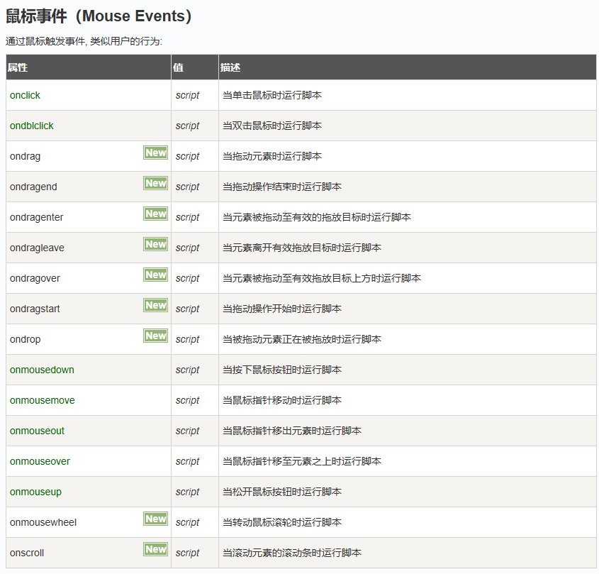
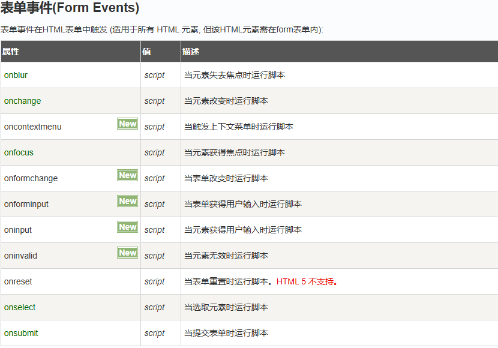
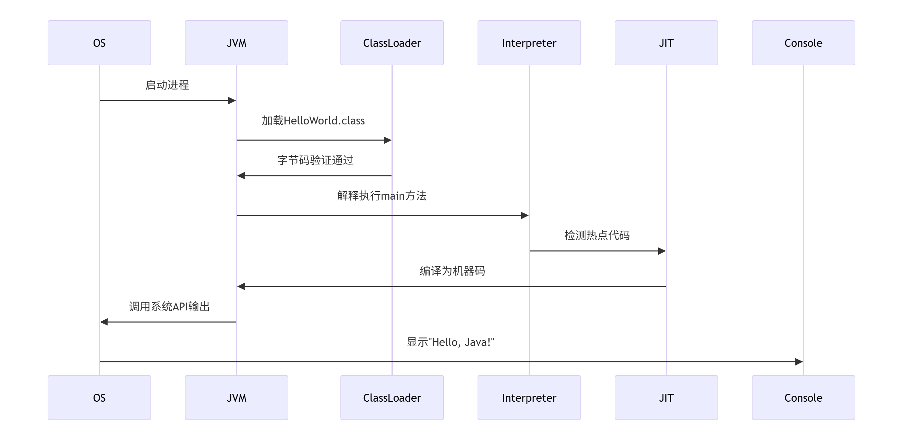
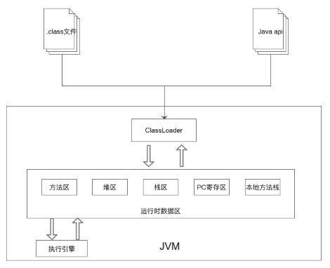
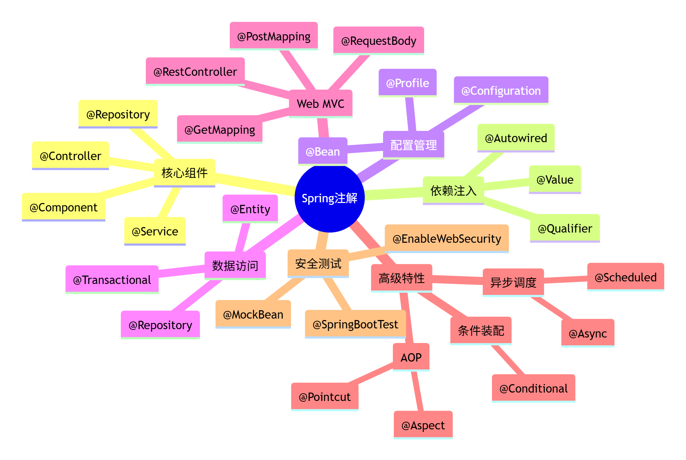
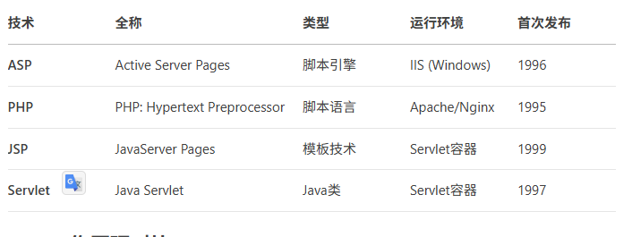

# Web Programming
跨域：协议 域名 端口任一不同就是跨域
协议
域名
端口

一个完整的URL通常包括以下部分：
   - **协议（Protocol）**：如`http://`或`https://`
   - **主机名（Hostname）**：如`example.com`
   - **端口（Port）**：可选，如`:8080`
   - **路径（Path）**：如`/api/users`
   - **查询参数（Query Parameters）**：可选，如`?id=123&name=foo`
   - **片段（Fragment）**：可选，如`#section1`（通常用于前端页面锚点，不会发送到服务器）

URL:统一资源定位符，用于定位互联网上的资源，如：http://www.example.com/index.html 俗称网络地址，简称网址
可以是服务器上的一个物理文件、动态生成的内容或者一个API端点(endpoint)

当服务器收到一个请求时，它会根据请求的URL路径和请求方法（GET、POST等）来决定由哪个处理程序（handler）来处理这个请求。这个过程称为路由（routing）。

- 如果URL指向的是静态文件目录中的文件，那么它对应服务器上的具体文件。
- 如果URL指向的是后端定义的路由（常见于RESTful API），那么它对应的是一个由后端程序处理的逻辑端点（endpoint），返回的数据是动态生成的（可能是从数据库中获取，经过计算等）。
- 因此，URL具体对应什么，取决于服务器的配置和后端程序的路由设计。

/:根目录 localhost:8080 web应用的启动路径作为服务的根目录
./:当前目录
../:上一级目录
文件相对路径:相对于web应用的路径，
html  js
url:统一资源定位符 带.html会直接访问html文件，不带.html会识别为路径，触发重定(向访问index.html)或404

# HTML
静态资源
动态资源:js node.js等生成
html转义字符 &，可以用来在网页展示html tag标签
&#128515; emoji表情

各种tag标签的用途 及属性

## 全局属性
id style class lang title
accesskey:设置快捷键,如：accesskey="h" 可以通过alt+h快速聚焦到该标签，a标签就会跳转或下载
draggable dropzone
hidden tabindex
contenteditable:是否可以直接在浏览器里编辑标签内容
contextmenu:右键标签时的上下文菜单,主流都不支持   
spellcheck  translate
dir:ltr rtl auto
data-*:domElement.getAttribute("data-animal-type")

## 事件属性

## 基础
html:代表当前doc
head:网页的头部，包含网页的元信息，如标题、样式表、脚本等
title:网页的标题，显示在浏览器的标题栏
body:网页的主体，包含网页的内容，如文本、图片、链接、表格等
meta:网页的元信息，如描述、关键词、作者等
h1 到h6:网页的标题，h1是最大的标题，h6是最小的标题
p:网页的段落
br:网页的换行
hr:网页的水平线 标签定义 HTML 页面中的主题变化（比如话题的转移），并显示为一条水平线
!--...--:网页的注释

## 格式
1. acronym abbr:缩写,鼠标放到标签内的文本上时，会显示title属性的内容 <abbr title="World Health Organization">WHO</abbr>
2. address 标签定义文档作者/所有者的联系信息。
	如果 address 元素位于 body 元素内部，则它表示该文档作者/所有者的联系信息。
	如果 address 元素位于 article 元素内部，则它表示该文章作者/所有者的联系信息。
	address 元素的文本通常呈现为斜体。大多数浏览器会在该元素的前后添加换行。
3. b:粗体文本
4. bdi:bdi 指的是 bidi 隔离（Bi-directional Isolation）。
	标签允许您设置一段文本，使其脱离其父元素的文本方向设置。
	在发布用户评论或其他您无法完全控制的内容时，该标签很有用。
	bdo:标签覆盖默认的文本方向。Bi-Directional Override
5. blockquote:定义摘自另一个源的块引用
6. cite:标签定义作品（比如书籍、歌曲、电影、电视节目、绘画、雕塑等等）的标题
7. code:短语标签，它表示计算机代码片段，不建议使用，还包括em strong dfn samp kbd var cite code
8. del:标签定义文档中已被删除的文本。中划线 <del>删除</del>
9. i:斜体文本
10. ins:标签定义文档中插入的文本。下划线 <ins>插入</ins>
11. mark:标签定义带有记号的文本。背景色高亮 <mark>高亮</mark>
12. meter:标签定义度量衡（单位）。仅用于已知最大和最小值的度量。百分比占比条形图.value min max low high optimum
13. pre:标签定义预格式化的文本。保留文本的空格和换行符，文本会以等宽字体显示，如：`<pre>hello world</pre>`
14. progress:表示进行中的任务进度，可以用来显示任务的进度条。value max
15. q:定义短的引用。引用的文本会自动添加引号，如：`<q>hello world</q>`
16. s:定义加删除线的文本。表示不再准确或过时但未被删除的文本，如电子商务中的原价显示，一般独立使用.del表示内容被删除、替换，通常与ins一起使用，用于文档修订和版本控制
17. sub/sup:定义下标或上标文本。sub:下标 sup:上标
18. time:标签定义一个日期/时间。datetime属性指定日期/时间，如：`<time datetime="2021-01-01">2021年1月1日</time>`,以机器可读的方式对日期时间进行编码,能够把生日提醒或排定的事件添加到用户日程表中，搜索引擎也能够生成更智能的搜索结果
19. wbr:word break
## 表单
留学申请表 信息确认表等，是一个数据，含有非常多的不同信息，如电话 邮箱 年龄 职业 学历等;而table则是多个数据，所有的数据都有相同的字段;一个表单数据可以是表格数据里的一行数据
1. form:定义一个表单，用于提交数据到服务器,可以包含以下一个或多个表单元素
2. input:定义一个输入字段，用于接收用户输入,元素是空的,它只包含标签属性,可以没有结束标签,可以使用label元素定义标注
   1. 支持各种输入**type**,如button checkbox color date datetime datetime-local email file hidden image month number password radio range reset search submit tel text time url week
   2. 还有各种属性，如**alt** accept autocomplete autofocus checked disabled **form** formaction formenctype formmethod formnovalidate formtarget height max maxlength min multiple name pattern placeholder **readonly** required **size**字符数 step type **value** width list引用datalist元素
3. textarea:定义一个多行文本输入控件
4. button:定义一个按钮，用于提交表单或执行其他操作,与input的type="button"类似，但可以包含其他元素，如文本、图片等
5. select:定义一个下拉列表，用于选择一个选项
6. option:定义下拉列表中的一个选项
7. optgroup:定义一个选项组，用于将多个选项分组
8. label:定义一个标签，用于描述输入字段
9. fieldset:定义一个字段集，用于将表单中的相关元素分组
10. legend:定义一个图例，用于描述字段集
11. datalist:定义一个数据列表，用于提供输入字段的预定义选项
12. keygen:定义一个密钥对生成器字段
13. output:定义一个计算结果，用于显示表单的输出结果

## 框架
1. frame:定义一个框架,布局整个页面
2. frameset:定义一个框架集，用于包含多个框架
3. iframe:定义一个内联框架，用于嵌入另一个文档作为部分内容
## 图像
1. img:定义一个图像，用于显示图片,技术上图像并没有插入HTML页面,而是链接到HTML页面上,src属性指定图片的路径，alt属性指定图片的替代文本，width和height属性指定图片的宽度和高度 usemap属性指定图片的映射
2. map:定义一个客户端图像映射，用于定义带有可点击区域的图像 name属性指定映射的名称 id
3. area:定义一个图像映射中的可点击区域 永远嵌套在map标签内 shape属性指定区域的形状，可以是rect、circle、poly，coords属性指定区域的坐标，href属性指定区域的链接，alt属性指定区域的替代文本, rel属性指定链接的关系
4. canvas:定义一个画布，用于绘制图形 width和height属性指定画布的宽度和高度
5. figcaption:定义一个图像的标题 为figure标签定义标题
6. figure:定义一个图像及其标题的组合
## 音频/视频
1. audio:定义一个音频播放器，用于播放音频文件 src属性指定音频文件的路径，controls属性指定是否显示播放控件 loop属性指定是否循环播放 autoplay属性指定是否自动播放 muted属性指定是否静音
2. video:定义一个视频播放器，用于播放视频文件 src属性指定视频文件的路径，controls属性指定是否显示播放控件 loop属性指定是否循环播放 autoplay属性指定是否自动播放 muted属性指定是否静音
3. source:定义一个媒体文件，用于指定视频或音频的源文件 type属性指定媒体文件的类型,不同浏览器支持不同格式的媒体文件，通过提供多个源，浏览器会自动选择第一个可用的源 开发者可以确保媒体内容能够在各种浏览器和设备上正常播放
4. track:定义一个媒体文件的字幕，用于指定视频或音频的字幕文件 src指定字幕URL srclang属性指定字幕的语言，label属性指定字幕的标签
## 链接
1. a:定义一个超链接或者锚，href属性指定链接的目标地址，target属性指定链接的打开方式，如_blank在新窗口打开，_self在当前窗口打开，_parent在父窗口打开，_top在顶级窗口打开 download属性指定链接的下载文件名 rel属性指定当前文档与目标链接的关系，如noopener noreferrer
2. link:定义一个链接，用于链接到外部资源，如样式表、图标等 rel属性指定链接的关系relationshape，如stylesheet、icon、preload href属性指定链接的目标地址 常用于链接样式表 空元素仅包含属性
3. main:定义文档的主要内容，用于突出显示文档的主要部分，如文章、图片等
4. nav:定义一个导航链接的部分，用于链接到其他页面，如菜单、目录等

## 列表
1. ul:无序列表
2. ol:有序列表 带序号 start属性指定列表的起始序号 reversed属性指定列表的序号是否倒序
3. li:列表项
4. dl:定义一个描述列表 列表的容器元素 展示术语及其定义的语义化元素 description list
5. dt:定义描述列表中的术语或短语 description terminology
6. dd:定义描述列表中术语的定义或解释 description details
7. menu:定义一个菜单列表 主流浏览器都不支持
8. dir:定义一个目录列表，已废弃
9. command:定义一个命令按钮 也不支持

## 表格
1. table:定义一个表格
2. caption:定义表格的标题 直接放置在table元素后边
3. th:定义表格中的表头单元格
4. tr:定义表格中的一行
5. td:定义表格中的一个单元格
6. thead:表格的表头部分 可用于修改表格的样式 或者长表格打印时，每一页都有表头
7. tbody:定义表格的主体部分
8. tfoot:定义表格的页脚部分
9. col:定义表格中的一列 span属性指定横跨的列数 可以向整个列应用样式
10. colgroup:定义表格中的一组列

## 样式/节

1. style:定义文档的样式，用于定义CSS样式表
2. div:定义一个块级容器元素，用于将内容分组，可以包含其他元素，如文本、图片等 division, HTML5引入了很多语义化标签header main footer nav代替div
3. span:定义一个行内容器元素，用于对文档中的行内元素进行组合,跨度 跨距
4. header:定义文档或者文档一部分区域的一个页眉，用于包含标题、导航链接等
5. footer:定义文档或者文档一部分区域的一个页脚，用于包含版权信息、链接等
6. section:定义一个节、文档中的独立部分，用于将内容分组，如文章、章节等
7. article:定义一个文章，用于表示独立内容、自包含内容，如博客文章、新闻文章等
8. aside:定义一个侧边栏，用于包含与主要内容相关的信息，如广告、侧边栏等
9. details:定义一个详细内容，用于展开或折叠内容，如FAQ、详细信息等
10. dialog:定义一个对话框，用于显示对话框内容，如弹出窗口、对话框等
11. summary:定义一个详细内容的摘要，用于显示详细内容的标题，如FAQ、详细信息等

## 元信息
1. head:定义文档的头部，用于包含文档的元数据，如标题、样式表、脚本等
2. meta:定义文档的元数据，用于指定文档的字符集、作者、描述、关键词等, name指定元数据名称，content指定元数据内容
3. base:定义文档的基础URL，用于指定文档中所有链接的基础URL

## 程序
1. script:定义一个脚本，用于执行JavaScript代码，src属性指定脚本的URL，type属性指定脚本的类型，如text/javascript，async属性指定脚本是否异步执行，defer属性指定脚本是否延迟执行
2. noscript:定义一个替代脚本，用于在不支持脚本的浏览器中显示内容
3. embed:定义一个嵌入的内容，用于嵌入其他内容，如视频、音频、插件等,建议使用img iframe video audio等标签代替
4. object:定义一个嵌入的对象,本意取代img applet,但主流浏览器都不支持

script 定义脚本 src:引入外部js文件 
type:定义脚本类型
传统类型:text/javascript
ES6支持module，script type="module" src="./orbitcontroller.js"
type="importmap"
特点:
1. 模块作用域 封装性
2. 支持import export

# Javascript
对象 函数 类 方法
## 函数：
函数可以通过声明定义，也可以是一个表达式,";"用来分割可执行的JavaScript语句
1. 函数声明 **function functionName(parameters){statements}**无";"在使用的地方进行调用**functionName(parameters);**
2. 函数表达式定义一个函数 var x = function (a, b) {return a * b}; var z = x(4, 3); 实际是一个匿名函数，通过变量名调用
3. Function构造函数
4. 函数提升:函数声明会被提升到作用域的顶部，函数表达式不会被提升
5. 自调用函数:函数表达式可以自调用,即自动调用，(function(){})()函数表达式后面紧跟()就会自动调用,声明的函数无法自调用,实际是匿名自我调用函数
6. js函数是一个对象,有属性和方法,如arguments.length,arguments.callee,arguments.callee.caller
7. 箭头函数表达式:ES6支持箭头函数表达式，语法为：var x = (parameters) => {statements}; 如果只有一个参数，可以省略括号，如果只有一条语句，可以省略花括号和return关键字，如：var x = (a, b) => a * b;
8. getter函数 使用get关键字定义的属性，当做属性用，实际上是一个函数，如：var person = {firstName:"John", lastName:"Doe", get fullName() {return this.firstName + " " + this.lastName;}}

## 对象：
对象是变量的容器，是键值对的容器，对象是属性的无序集合，属性是键值对，键是字符串，值可以是任意类型，如：var person = {firstName:"John", lastName:"Doe", age:50, eyeColor:"blue"};
1. 对象的属性可以通过点符号或方括号来访问，如：person.firstName或person["firstName"]
2. 对象的属性可以通过点符号或方括号来修改，如：person.firstName = "Mike"或person["firstName"] = "Mike";
3. 对象方法是包含函数定义的属性，如：var person = {firstName:"John", lastName:"Doe", age:50, eyeColor:"blue", fullName: function() {return this.firstName + " " + this.lastName;}}
4. 方法的访问方式与属性相同，如：person.fullName()或person["fullName"]();person.fullName打印函数体，person.fullName()打印函数返回值

## 类：
类是对象的蓝图，类可以定义属性和方法，如：class Car { constructor(brand) { this.carname = brand; } }
1. 类的构造函数用于创建对象，构造函数的参数是对象的属性，构造函数的this关键字用于引用对象的属性，如：this.carname = brand;

## prototype
每个JavaScript对象(null除外)在创建时都会关联另一个对象，这个对象就是我们所说的原型，每个对象都会从原型继承属性和方法，原型链是JavaScript中实现继承的一种方式，原型链的顶端是Object.prototype，Object.prototype没有原型，原型链的终点是null。

## import export
ES6支持模块化，模块是自包含的代码单元，可以导入和导出，模块可以包含变量、函数、类等，模块的导入和导出使用import和export关键字，如：export {myFunction, myVariable};import {myFunction, myVariable} from './myModule.js';

导出包含命名导出和默认导出
命名导出需要使用{}包裹，并且名字完全一致，可以as重命名
一个模块只能有一个默认导出export default ，默认导出可以是任何类型的值，如：export default function() {console.log('Hello, world!');}, 导入时可以任意命名 本质是import {default as myFunction} from './myModule.js';
一个文件/脚本就是一个模块

$变量:
1. jQuery中是jQuery的别名，存储jQuery对象，可以通过$访问jQuery对象的方法和属性，如：$(document).ready(function(){});
2. 在Node.js中是全局变量，存储当前模块的上下文对象，可以访问当前模块的属性和方法，如：console.log(module.filename);
3. 在现代前端框架中，如React、Vue等，$变量通常用于存储框架的实例，可以通过$访问框架的方法和属性，如：ReactDOM.render(<App />, document.getElementById('root'));

## this
this 的多种指向:实际都是调用的最近的object对象
 1、在对象方法中， this 指向调用它所在方法的对象。
 2、单独使用 this，它指向全局(Global)对象,浏览器中是window, Node.js中是global。
 3、函数使用中，this 指向函数的所属者。
 4、严格模式下函数是没有绑定到 this 上，这时候 this 是 undefined。
 5、在 HTML 事件句柄中，this 指向了接收事件的 HTML 元素。
 6、apply 和 call 允许切换函数执行的上下文环境（context），即 this 绑定的对象，可以将 this 引用到任何对象。
 7、箭头函数没有自己的 this，它会捕获其定义时所在上下文的 this 值，作为自己的 this 值。在对象方法的定义里，仍然指向window

 console.log(obj)可以在浏览器的console中查看obj的数据类型和内容
 typeof obj可以查看obj的数据类型

## 简写
1. (()=>{console.log("hello")})() 自调用闭包函数
2. const obj={x:1,y:2}; const {x,y}=obj; 解构赋值
3. 模板字符串'${variable}'，可以嵌入变量或表达式，如：`Hello, ${name}!`，`The sum of ${a} and ${b} is ${a + b}.`
4. import @/router-->从@路径下的router文件夹导入router.js router.vue或者index.js index.vue

js文件的作用域
1. 浏览器环境中，全局作用域是window对象，全局变量是window对象的属性，全局函数是window对象的方法，全局变量和函数在全局作用域中都可以访问，全局变量和函数在全局作用域中都可以修改，全局变量和函数在全局作用域中都可以删除。多个script标签引入的多个js文件的全局变量和函数都会挂载到window对象
2. Node.js环境中，每个文件都被视为独立模块，有自己的作用域，模块内声明的var只能在本模块内使用，不会挂载到Node.js的全局对象global上，需要显示import/export

# CSS

不同部分的说明：
- Margin(外边距) - 清除边框外的区域，外边距是透明的。
- Border(边框) - 围绕在内边距和内容外的边框。
- Padding(内边距) - 清除内容周围的区域，内边距是透明的。
- Content(内容) - 盒子的内容，显示文本和图像。

插入样式表的三种方式：
1. 外部样式表：在HTML文件中通过<link>标签引入外部CSS文件，如：<link rel="stylesheet" type="text/css" href="style.css">
2. 内部样式表：在HTML文件中使用
3. 内联样式表：在HTML元素的style属性中定义CSS样式，如：
This is a paragraph.

https://www.runoob.com/cssref/css-selectors.html
1. id选择器:#id {color: red;} id选择器用于选择具有特定id属性的元素，id属性是唯一的，id选择器可以用于任何元素。
2. class选择器:.class {color: red;} class选择器用于选择具有特定class属性的元素，class属性可以用于任何元素。
3. 元素选择器:element {color: red;} 元素选择器用于选择具有特定元素的元素，如：p {color: red;} 选择所有的段落元素。
4. 属性选择器:[attribute=value] {color: red;} 属性选择器用于选择具有特定属性的元素，如：[title=hello] {color: red;} 选择所有具有title属性且值为hello的元素。可以有各种表达式
5. 后代选择器:element element {color: red;} 后代选择器用于选择具有特定元素的后代元素，如：div p {color: red;} 选择所有div元素中的段落元素(不论嵌套了几层)。
6. 子元素选择器:element > element {color: red;} 子元素选择器用于选择具有特定元素的子元素，如：div > p {color: red;} 选择所有div元素的直接子元素(只能是第一层子元素)。
7. 相邻兄弟选择器:element + element {color: red;} 相邻兄弟选择器用于选择具有特定元素的相邻兄弟元素，如：h1 + p {color: red;} 选择所有h1元素后面的第一个段落元素。
8. 通用兄弟选择器:element ~ element {color: red;} 通用兄弟选择器用于选择具有特定元素的通用兄弟元素，如：h1 ~ p {color: red;} 选择所有h1元素后面的所有段落元素。
9. 伪类选择器:element:pseudo-class {color: red;} 伪类选择器用于选择具有特定状态的元素，如：a:hover {color: red;} 选择所有鼠标悬停的链接元素。
10. 伪元素选择器:element:pseudo-element {color: red;} 伪元素选择器用于选择具有特定位置的元素，如：p:first-line {color: red;} 选择所有段落的第一行。
11. 组合选择器:element1, element2 {color: red;} 组合选择器用于选择具有特定元素的元素，如：p, div {color: red;} 选择所有段落和div元素。
12. 

# AJAX
AJAX = Asynchronous JavaScript and XML
AJAX 最大的优点是在不重新加载整个页面的情况下，可以与服务器交换数据并更新部分网页内容
通过在后台与服务器进行少量数据交换，AJAX 可以使网页实现异步更新。这意味着可以在不重新加载整个网页的情况下，对网页的某部分进行更新。

传统的网页（不使用 AJAX）如果需要更新内容，必需重载整个网页面。

XMLHttpRequest 是实现 Ajax 的一种方式，当然也可以使用 fetch API(基于promise) 等现代方法。
google的ajax库：jQuery
Google搜索的suggest使ajax流行起来的，当在搜索框中输入字符时，它会发送一个请求到服务器，然后服务器返回匹配的搜索结果，然后客户端使用JavaScript动态更新搜索框中的内容，而不需要重新加载整个页面。

jQuery:一个快速、简洁的JavaScript库，简化了HTML文档遍历、事件处理、动画和Ajax交互

# Java

JVM内存模型（Java Virtual Machine Memory Model），它定义了Java程序在运行时的内存结构和管理方式。JVM内存模型主要包括以下几个部分：

​​1. 方法区（Method Area）​​：存储类信息、常量、静态变量、即时编译器编译后的代码等数据。在JDK 8之前，方法区由永久代（PermGen）实现，而JDK 8及以后使用元空间（Metaspace）实现，元空间位于本地内存（Native Memory）中。
​2. ​堆（Heap）​​：Java对象实例和数组都在堆上分配内存，这是垃圾收集器管理的主要区域。堆可以细分为新生代（Young Generation）和老年代（Old Generation）。新生代又分为Eden区和两个Survivor区（通常称为From Survivor和To Survivor）。
​3. ​虚拟机栈（Java Virtual Machine Stacks）​​：每个线程在创建时都会创建一个虚拟机栈，栈中保存栈帧（Stack Frame），每个方法调用都会创建一个栈帧。栈帧包括局部变量表、操作数栈、动态链接、方法返回地址等。
4. ​​本地方法栈（Native Method Stack）​​：与虚拟机栈类似，但服务于Native方法（用其他语言编写的方法）。
​5. ​程序计数器（Program Counter Register）​​：每个线程都有一个程序计数器，用于记录当前线程执行的字节码指令地址。如果执行的是Native方法，则计数器值为空（Undefined）。
​6. ​直接内存（Direct Memory）​​：并不是JVM运行时数据区的一部分，但也被频繁使用。它是通过Native函数库直接分配的堆外内存，比如NIO使用DirectByteBuffer来操作直接内存。

下面我们详细说明每个部分：
1. 方法区（Method Area）
存储已被虚拟机加载的类信息、常量、静态变量、即时编译器编译后的代码等。
在JDK 8之前，方法区由永久代（PermGen）实现，永久代的大小受JVM设置的最大永久代大小限制（-XX:MaxPermSize），容易导致内存溢出（如常见的java.lang.OutOfMemoryError: PermGen space）。
JDK 8及以后，永久代被移除，取而代之的是元空间（Metaspace），元空间使用本地内存，因此默认情况下只受本地内存限制。可以通过参数-XX:MetaspaceSize和-XX:MaxMetaspaceSize设置初始大小和最大大小。
2. 堆（Heap）
堆是JVM管理的最大一块内存区域，几乎所有对象实例和数组都在这里分配内存。
堆是垃圾收集器管理的主要区域，因此也称为GC堆（Garbage Collected Heap）。
堆可以分为新生代和老年代：
​​新生代​​：新创建的对象首先分配在新生代。新生代又分为：
Eden区：新对象在此分配。
Survivor区：分为From Survivor和To Survivor，用于存放经过Minor GC后仍然存活的对象。
​​老年代​​：存放长期存活的对象（经过多次Minor GC仍然存活的对象）以及大对象（比如大数组，直接进入老年代）。
堆的大小可以通过JVM参数设置：
-Xms：堆初始大小
-Xmx：堆最大大小
-Xmn：新生代大小（通常为整个堆的1/3到1/4）
-XX:SurvivorRatio：Eden区与Survivor区的比例（例如8表示Eden:Survivor=8:1:1）
3. 虚拟机栈（Java Virtual Machine Stacks）
每个线程在创建时都会创建一个虚拟机栈，栈中保存栈帧（Stack Frame）。
每个方法调用都会创建一个栈帧，方法调用结束（正常返回或抛出异常）时栈帧被销毁。
栈帧包括：
​​局部变量表​​：存放方法参数和方法内部定义的局部变量。
​​操作数栈​​：用于存放操作数，是执行字节码指令的工作区。
​​动态链接​​：指向运行时常量池中该栈帧所属方法的引用，以便在运行时将符号引用转换为直接引用。
​​方法返回地址​​：方法返回时，需要返回到调用该方法的地方继续执行。
栈的大小可以通过参数设置：-Xss（例如-Xss1m）。
4. 本地方法栈（Native Method Stack）
与虚拟机栈类似，但服务于Native方法（用其他语言编写的方法）。
在HotSpot虚拟机中，本地方法栈和虚拟机栈是合二为一的。
5. 程序计数器（Program Counter Register）
每个线程都有一个程序计数器，用于记录当前线程执行的字节码指令地址（如果当前执行的是Native方法，则计数器值为空）。
程序计数器是线程私有的，生命周期与线程相同。
它是唯一一个在JVM规范中没有规定任何OutOfMemoryError情况的区域。
6. 直接内存（Direct Memory）
直接内存并不是JVM运行时数据区的一部分，但它在Java程序中被频繁使用（例如NIO的DirectByteBuffer）。
直接内存的分配不受Java堆大小的限制，但会受到本机总内存的限制。
直接内存的读写速度通常比堆内存快，因为它避免了在Java堆和Native堆之间来回复制数据。

package com.example.demo;//包声明，就是个命名空间，防止命名冲突，包名一般用小写字母，一般约定就是xxx.java的文件路径
import 的原理是编译时解析，导出引用或者地址

注解:本质就是一个接口，继承自java.lang.annotation.Annotation,为Java 类或方法、参数等程序元素提供额外的元数据机制，类似Qt的moc\dicom的meta等，这些信息可以在编译时、加载时或运行时被读取和处理。注解本身不会直接影响代码逻辑，但可以通过其他工具（如编译器、框架等）来改变程序的行为或生成额外的代码
使用注解时，实际上是使用接口的实例,使用反射机制修饰代码
注解的作用：
​- ​编译检查​​：例如@Override注解用于指示方法覆盖了父类的方法，编译器会检查是否真的覆盖，如果没有则报错。
​- ​生成文档​​：例如@Deprecated表示该方法已过时，在生成文档时会特别标记。
​- ​代码分析​​：通过注解，工具可以在编译时或运行时分析代码，例如生成代码、进行验证等。
​- ​框架配置​​：在框架中广泛使用，例如Spring中的@Controller、@Autowired等，用于配置组件和依赖注入。

注解的参数是键值对的形式,参数类型只能是基本类型、String、Class、枚举、注解、以及这些类型的数组。有默认值的可以不写,只有一个value参数时可省略value键

元注解:注解的注解
@Retention - 标记的注解的保留策略
	RetentionPolicy.SOURCE: 注解只在源代码中保留，编译时被忽略。
	RetentionPolicy.CLASS: 注解在编译时被保留到 class 文件中，但在运行时被 JVM 忽略（默认行为）。
	RetentionPolicy.RUNTIME: 注解在运行时也被保留，因此可以通过反射机制读取到。
@Target - 作用目标 定义了被标记的注解可以应用于哪些程序元素
	ElementType.TYPE: 可以用于类、接口（包括注解类型）或枚举声明。
	ElementType.FIELD: 可以用于字段（包括枚举常量）。
	ElementType.METHOD: 可以用于方法。
	ElementType.PARAMETER: 可以用于参数。
	ElementType.CONSTRUCTOR: 可以用于构造函数。
	ElementType.LOCAL_VARIABLE: 可以用于局部变量。
	ElementType.ANNOTATION_TYPE: 可以用于注解
@Documented - 文档收录 表示被标记的注解应该由 javadoc 工具记录。默认情况下，javadoc 是不会包含注解的，但如果一个注解被 @Documented 标记，那么它会被包含在生成的文档中。
@Inherited - 继承特性 表示被标记的注解@A可以被子类继承,在父类Parent上使用@A注解时,子类Child也会继承@A注解
@Repeatable - 重复注解 表示一个注解可使用多次 如多个作者、标签等，使用@Repeatable时，必须定义一个容器注解（如@Authors），其value类型是重复注解的数组

@interface - 定义注解
interface - 定义接口

## spring注解

核心注解：
	@Component: 标记一个类为Spring容器管理的组件（Bean）。它是所有Spring管理的组件的通用注解。
	@Service: 用于标记服务层的组件，是@Component的特例。
	@Repository: 用于标记数据访问层（DAO）组件，同时具有将数据库操作抛出的原生异常转换为Spring的DataAccessException的功能。
	@Controller: 用于标记控制器组件（如Spring MVC控制器）。
	@Autowired: 用于自动装配依赖，可以用在字段、构造器、setter方法上。
	@Qualifier: 当有多个相同类型的Bean时，用于指定具体装配哪一个Bean。
	@Value: 用于注入属性值（从properties文件、环境变量等）。
Spring MVC注解：
	@RequestMapping: 用于映射Web请求（URL）到处理方法。可以指定HTTP方法（GET, POST等）。
	@GetMapping, @PostMapping, @PutMapping, @DeleteMapping, @PatchMapping: 分别对应不同HTTP方法的请求映射。
	@RequestParam: 用于获取请求参数。
	@PathVariable: 用于获取URL模板变量（即路径变量）。
	@RequestBody: 用于将HTTP请求体转换为Java对象（通常用于接收JSON/XML数据）。
	@ResponseBody: 用于将方法返回的对象直接写入HTTP响应体（通常用于返回JSON/XML数据）。
	@RestController: 组合注解，相当于@Controller和@ResponseBody的组合，用于RESTful Web服务。
	@ModelAttribute: 用于绑定请求参数到模型对象，或者用于在方法执行前初始化模型对象。
配置相关注解：
	@Configuration: 标记一个类为配置类，相当于XML配置文件。
	@Bean: 在配置类中声明一个Bean，方法返回的对象将被Spring容器管理。
	@ComponentScan: 用于自动扫描并注册组件（配合@Configuration使用）。
	@PropertySource: 用于加载properties文件到Spring的环境变量中。
	@Import: 用于导入其他配置类。
	@Profile: 用于指定Bean在哪个环境（profile）下被激活。
事务管理注解：
	@Transactional: 用于声明事务（方法或类级别），可以配置事务的传播行为、隔离级别、超时等。
测试相关注解：
	@SpringBootTest: 用于Spring Boot应用的集成测试，会加载完整的应用程序上下文。
	@Test: 标记一个方法为测试方法（JUnit）。
	@MockBean: 在Spring测试中模拟一个Bean。
切面编程（AOP）注解：
	@Aspect: 声明一个切面。
	@Pointcut: 定义切点表达式。
	@Before, @After, @AfterReturning, @AfterThrowing, @Around: 定义通知类型（在切点之前、之后等执行）。
	@EnableAspectJAutoProxy: 启用Spring AOP自动代理。
Spring Boot特有注解：
	@SpringBootApplication: 用于主配置类，是@Configuration、@EnableAutoConfiguration和@ComponentScan的组合。
	@EnableAutoConfiguration: 启用Spring Boot的自动配置机制。
条件注解（Conditional）：
	@ConditionalOnClass, @ConditionalOnMissingBean, @ConditionalOnProperty等：根据条件决定是否创建Bean。
异步与调度：
	@Async: 标记方法为异步执行。
	@EnableAsync: 启用异步方法执行功能。
	@Scheduled: 标记方法为定时任务。
	@EnableScheduling: 启用定时任务功能。
安全注解（Spring Security）：
	@EnableWebSecurity: 启用Web安全配置。
	@Secured: 用于方法安全，指定访问该方法的角色列表。
	@PreAuthorize, @PostAuthorize: 方法执行前/后进行权限检查。
验证注解（Bean Validation）：
	@Valid: 用于触发对方法参数的验证（通常与@RequestBody一起使用）。
	@NotBlank, @Email, @Size等: 用于字段验证的约束注解。
缓存注解：
	@Cacheable: 标记方法的结果可缓存。
	@CacheEvict: 标记方法用于清除缓存。
	@CachePut: 更新缓存。
	@EnableCaching: 启用缓存功能。
消息注解（Spring Messaging）：
	@MessageMapping: 用于映射消息（如WebSocket消息）到处理方法。
	@SendTo: 指定处理方法的返回消息发送到哪个目的地。
国际化（i18n）：
	@LocaleResolver: 配置区域解析器。
	@MessageSource: 配置国际化消息源。
其他：
	@Lazy: 延迟初始化Bean。
	@Scope: 指定Bean的作用域（如：prototype, request, session等）。
	@Primary: 当有多个同类型Bean时，标记为首选Bean。

## Spring框架
Spring 框架的核心机制和原理。Spring 的核心可以概括为 IoC（控制反转） 和 AOP（面向切面编程），而这一切都建立在它的容器（Container） 之上。Spring 容器负责管理对象的生命周期，包括对象的创建、配置和销毁等。Spring 容器通过依赖注入（Dependency Injection）的方式将对象之间的依赖关系交给容器管理，从而实现了松耦合的设计。

**一、核心思想：IoC（控制反转）与 DI（依赖注入）**
要理解 Spring，首先必须彻底理解这两个概念。

什么是控制反转 (IoC)？

传统程序：在传统应用程序中，对象自己控制其依赖的创建和查找。比如，A 类需要 B 类，那么 A 内部会通过 new B() 来创建依赖。控制权在程序本身。

IoC 程序：控制权被反转了。对象的创建、组装、管理权交给了外部容器（Spring Container）。你不再需要自己 new 对象，而是由容器主动帮你创建好并注入到需要的地方。控制权从程序代码转移到了外部容器。

什么是依赖注入 (DI)？

DI 是 IoC 的实现方式。控制反转是一个设计思想，而依赖注入是这个思想的具体实现。它的意思是：容器通过设置器方法（Set注入）或构造函数（构造器注入）等方式，将依赖对象注入到被调用的对象中。

**二、核心机制：Spring 容器与 Bean**
Spring 机制的核心就是一个“超级工厂”，也就是 IoC 容器，它负责管理所有被称为 Bean 的对象。

1. IoC 容器 (Container)
Spring 容器是 Spring 框架的“心脏”，它主要负责：

实例化 应用程序中的 Bean。

配置 这些 Bean（例如设置属性、注入依赖）。

组装 Bean 之间的关系（依赖注入）。

管理 Bean 的整个生命周期（从创建到销毁）。

主要的容器接口是 BeanFactory，但其更强大的子接口 ApplicationContext（应用上下文）更为常用。我们通常通过 ApplicationContext 来与容器交互。

2. Bean
在 Spring 中，那些由 IoC 容器创建和管理的对象统称为 Bean。Bean 就是应用程序的基石。

如何定义一个 Bean？

XML 配置（古老方式）：在 applicationContext.xml 文件中使用 <bean> 标签定义。

注解配置（现代方式）：在 Java 类上使用注解（如 @Component, @Service, @Controller, @Repository）来声明一个 Bean。

Java 配置（现代方式）：在配置类中使用 @Configuration 和 @Bean 注解来定义。

**三、Spring 的核心工作原理与流程**
Spring 容器启动时，会做一系列复杂的工作，其核心流程可以简化为以下几个步骤：

步骤 1：加载与解析配置 (Configuration Loading)
容器启动时，首先会读取配置文件（XML、注解或 Java Config），解析这些配置信息，确定哪些对象需要被管理，以及它们之间的依赖关系。

步骤 2：Bean 定义与注册 (Bean Definition)
解析后的配置信息会被转换为一个个 BeanDefinition 对象。BeanDefinition 是 Spring 的核心元数据，它包含了创建一个 Bean 所需要的所有信息，例如：

这个 Bean 的类名是什么？

它是单例还是原型（多例）？

它的依赖有哪些？

它的属性值是什么？

所有这些 BeanDefinition 会被注册到一个 “Bean 定义注册表” 中，你可以把它想象成容器的“花名册”。

步骤 3：Bean 的实例化与依赖注入 (Instantiation & DI) - 核心中的核心
这是最关键的阶段。容器（特别是 BeanFactory）会根据 BeanDefinition 的信息来创建 Bean 实例。这个过程通常是懒加载的（除非配置为急切加载），即在第一次被请求时才创建。

实例化：容器使用 Java 反射机制调用类的构造函数来创建 Bean 的实例。

属性填充（依赖注入）：容器解析该 Bean 的依赖关系（通过 @Autowired 等注解或 XML 配置标识），然后从容器中获取这些依赖的 Bean，并通过反射调用 setter 方法或直接通过构造函数将它们注入进去。

初始化：如果 Bean 实现了 InitializingBean 接口，容器会调用其 afterPropertiesSet() 方法。或者，如果配置了自定义的 init-method，也会在此阶段调用。此时，Bean 已经准备就绪，可以使用了。

步骤 4：AOP（面向切面编程）
如果配置了 AOP，容器会在 Bean 的初始化前后阶段，动态地生成代理对象。

Spring AOP 默认使用动态代理：

如果目标对象实现了接口 -> 使用 JDK 动态代理。

如果目标对象没有实现接口 -> 使用 CGLIB 字节码增强。

代理对象会负责在目标方法执行前后，织入切面逻辑（如日志、事务、安全等）。

最终，存放在容器里、被应用程序获取到的，很多时候是这个代理对象，而不是原始的 Bean 对象。

步骤 5：Bean 的使用与销毁
使用：应用程序通过 applicationContext.getBean() 或更常用的 @Autowired 注解从容器中获取完整的、注入好所有依赖的 Bean 来使用。

销毁：当容器关闭时，它会管理 Bean 的销毁生命周期。如果 Bean 实现了 DisposableBean 接口，容器会调用其 destroy() 方法，或者执行配置的自定义 destroy-method。

**四、关键特性与机制详解**
1. Bean 的作用域 (Scope)
Spring Bean 默认是单例的（Singleton），但支持多种作用域：

singleton：（默认）每个 Spring 容器中只有一个实例。

prototype：每次请求都会创建一个新的实例。

request：每次 HTTP 请求创建一个实例（Web 环境）。

session：每个 HTTP Session 创建一个实例（Web 环境）。

2. 自动装配 (Autowiring)
Spring 容器可以自动解析 Bean 之间的协作关系。通过 @Autowired 注解，容器会自动在上下文中查找匹配的 Bean 并注入进去。其背后的匹配规则通常是按类型（byType），如果找到多个相同类型的 Bean，再按名称（byName）进行匹配。

3. 事务管理
Spring 提供了声明式事务管理，其底层原理就是 AOP。

你在方法或类上添加 @Transactional 注解。

Spring 会为这个类创建一个代理对象。

当你调用代理对象的方法时，代理会在方法执行前开启事务，在方法执行后提交事务，如果遇到异常则回滚事务。

这一切对开发者来说是透明的，无需编写重复的事务管理代码。

**总结**
Spring 的机制原理可以概括为：

一个核心容器：ApplicationContext，它是所有 Bean 的“家”。

一个设计思想：IoC，将对象的控制权交给容器。

一个实现手段：DI，容器通过反射机制将依赖注入到对象中。

一个增强利器：AOP，通过动态代理无侵入地增强Bean的功能（如事务、日志）。

一套定义规则：BeanDefinition，它是容器创建和管理 Bean 的“蓝图”。

正是这些机制的结合，使得 Spring 能够有效地组织和管理大型企业级应用，让开发者专注于业务逻辑，而不是复杂的对象依赖管理。

## Spring AOP
**一、AOP含义及作用**
AOP 的全称是 Aspect-Oriented Programming。它的核心思想是：将那些遍布在应用程序多个模块中的、与核心业务逻辑无关的通用功能（称为“横切关注点”）抽离出来，集中管理和维护，然后再通过声明的方式将它们“织入”到业务代码中。

传统的OOP:
代码混乱：核心业务代码中混杂了大量非核心的代码。

代码分散：同样的日志、事务代码重复出现在无数个方法里。

维护困难：如果要修改，极易出错。

**二、AOP 的核心术语 (Core Concepts)**
理解这些术语是理解 AOP 的关键：

Aspect (切面)

是什么：将横切关注点模块化的特殊对象。它是一个类，包含了通知和切点。例如：LoggingAspect（日志切面）、TransactionAspect（事务切面）。

Join Point (连接点)

是什么：程序执行过程中一个明确的点，通常是方法的调用、异常的抛出等。在 Spring AOP 中，连接点总是代表一个方法的执行。

Advice (通知)

是什么：切面在特定连接点上执行的动作。它本身是一段代码，比如一个方法。通知定义了“做什么”和“何时做”。

主要类型：

Before Advice：在目标方法被调用之前执行。

After Returning Advice：在目标方法成功执行完成后执行。

After Throwing Advice：在目标方法抛出异常后执行。

After (Finally) Advice：无论目标方法如何结束（成功或异常），之后都会执行。

Around Advice：最强大的通知，它包围了连接点。可以在方法调用前后执行自定义行为，并决定是否继续执行连接点。

Pointcut (切点)

是什么：一个匹配连接点的表达式。通知是与一个切点表达式关联的。它定义了“在何处做”。

关键：切点决定了哪个类的哪个方法会收到通知。例如：表达式 execution(* com.example.service.*.*(..)) 匹配 service 包下所有类的所有方法。

Weaving (织入)

是什么：将切面应用到目标对象并创建代理对象的过程。这可以在编译期、类加载期或运行期实现。Spring AOP 是在运行时完成织入的。

Target Object (目标对象)

是什么：被一个或多个切面所通知的对象。也就是需要被增强的原始业务对象。

AOP Proxy (AOP 代理)

是什么：AOP 框架为了实现切面功能而创建的对象。在 Spring 中，这个代理可以是 JDK 动态代理或 CGLIB 代理。客户端代码调用的实际上是这个代理对象，而不是原始的目标对象。

## servlet
web技术演进:
静态网页1991-1995 无js--> 动态网页php95 js95 servelet/jsp97--->web2.0 ajax 2005 jQuery AngularJS--->web3.0 2010 react vue angular--->web4.0 2018 WebAssembly webGPU WebXR

jpa:java persistence api
jpa是java提供的一套持久化规范，它提供了一套标准的API来操作数据库，使得开发者可以不直接操作数据库，而是通过操作Java对象来操作数据库。jpa的实现有很多种，比如Hibernate、EclipseLink等。

Hibernate:是一个开源的对象关系映射（ORM）框架，它实现了JPA规范，使得开发者可以方便地使用JPA来操作数据库。Hibernate提供了丰富的功能，包括对象关系映射、缓存、事务管理等。

Servlet:是一个Java EE规范，它定义了如何处理HTTP请求和响应。Servlet是一个Java类，它实现了Servlet接口，可以处理HTTP请求和响应。Servlet可以用于构建Web应用程序，它可以在服务器端执行Java代码，并生成动态的Web内容。
HttpServlet:是Servlet的一个子类，它提供了处理HTTP请求和响应的方法。HttpServlet可以处理GET、POST、PUT、DELETE等HTTP请求方法，并生成HTML、JSON、XML等格式的响应内容。
生命周期:Servlet的生命周期包括初始化、服务、销毁三个阶段。在初始化阶段，Servlet容器会调用Servlet的init()方法来初始化Servlet。在服务阶段，Servlet容器会调用Servlet的service()方法来处理~~HTTP~~请求和响应。在销毁阶段，Servlet容器会调用Servlet的destroy()方法来销毁Servlet。
HttpServlet extends GenericServlet implements Servlet,ServletConfig
{
	protected void service(HttpServletRequest httpServletRequest,
                       HttpServletResponse httpServletResponse){
        //该方法通过httpServletRequest.getMethod()判断请求类型调用doGet() doPost()
   }
}

HttpServletRequest implent ServletRequest 
HttpServletResponse implent ServletResponse 

# web部署
## 服务器 容器
web服务器 应用服务器 servlet容器 

一、核心概念与比喻
Web 服务器 (Nginx, Apache)：处理HTTP请求，提供静态资源，转发动态请求并返回响应

特点：速度快、擅长处理简单重复的任务（静态文件服务、负载均衡）。

Servlet 容器 (Tomcat, Jetty)：管理Servlet的生命周期、线程池 创建ServletRequest、ServletResponse等对象

特点：它专门为“Java Servlet”服务，是应用服务器的核心组成部分。

应用服务器 (Tomcat EE, JBoss/WildFly, WebLogic)：不仅包含Servlet容器的所有功能，还支持完整的Java EE/Jakarta EE规范

特点：功能全面、重量级，为企业级应用（如复杂的金融、电商系统）提供全方位支持。

二、分点详细解释
1. Web 服务器 (Web Server)
是什么：主要处理 HTTP(S) 协议的软件。

核心功能：

托管静态内容：直接提供硬盘上已有的文件（.html, .css, .js, .jpg等）。

处理静态请求：速度快，效率高，因为不需要额外计算。

反向代理与负载均衡：将接收到的请求转发给后端的多个应用服务器，分散压力。

SSL/TLS 终止：处理 HTTPS 加密解密工作，减轻后端服务器压力。

代表产品：Nginx、Apache HTTP Server、Microsoft IIS（也具备应用服务器功能）。

2. Servlet 容器 (Servlet Container)
是什么：它是 Java Servlet 技术的运行环境。Servlet 是用 Java 编写服务器端程序的一套标准 API。

核心功能：

生命周期管理：负责加载、初始化、执行和销毁 Servlet。

通信支持：为 Servlet 提供了与 Web 服务器通信的接口，它解析来自 Web 服务器的请求，并将其转换为 Servlet 能理解的 HttpServletRequest 对象。同时，将 Servlet 返回的 HttpServletResponse 对象转换为 HTTP 响应发回 Web 服务器。

线程管理：为每个请求分配一个线程，处理多并发请求。

JSP 支持：将 JSP 页面编译并执行为 Servlet。

代表产品：Apache Tomcat、Eclipse Jetty。

3. 应用服务器 (Application Server)
是什么：它是一个功能更强大的运行时环境，用于运行业务逻辑（应用程序）。

核心功能：

包含 Servlet 容器的所有功能：一个应用服务器必然内嵌了一个 Servlet 容器。

支持完整的 Java EE/Jakarta EE 规范：提供除 Servlet/JSP 之外更多的企业级功能，如：

EJB 容器：用于部署和管理分布式业务组件（Enterprise JavaBeans）。

JMS：消息服务，支持异步通信。

JTA：管理分布式事务。

JPA：Java 持久化 API，更方便地操作数据库。

代表产品：WildFly (原名 JBoss)、IBM WebSphere、Oracle WebLogic。

三、关系与演进
包含关系：应用服务器 ⊃ Servlet 容器

Tomcat 是一个 Servlet 容器（尽管我们常称它为轻量级应用服务器）。

WildFly, WebLogic 是应用服务器，它们内部也包含了一个像 Tomcat 一样的 Servlet 容器来实现 Web 功能。

历史演进：

早期：Web 服务器（Apache）负责静态资源，遇到动态请求（如.jsp）通过 CGI 或 mod_jk 等模块转发给后端的 Servlet 容器（Tomcat） 处理。这是一种物理分离的部署方式。

现在：Tomcat 自身也具备了较强的静态资源处理能力。对于不涉及 EJB 等高级特性的普通 Java Web 应用（如 Spring Boot 应用），直接使用 Tomcat 作为唯一的服务器是最常见的选择。Spring Boot 甚至直接内置了 Tomcat，让你无需额外安装。

对于需要消息队列、分布式事务等复杂企业级功能的场景，才会选择完整的应用服务器（如 WildFly）。

现代开发中的常见模式：
Nginx (Web Server) + Tomcat (Servlet Container/Application Server)：

Nginx 放在最前面，处理所有静态请求（图片、CSS、JS），进行负载均衡和 SSL 加密。

对于动态请求（如 /api/xxx），Nginx 反向代理给后端的一个或多个 Tomcat 实例处理。

Tomcat 运行着你的 Java 应用程序（如 Spring MVC, Spring Boot），处理业务逻辑，访问数据库，生成动态内容。

web服务器：
1. Nginx:高性能 高并发 反向代理 负载均衡
2. Apache HTTP Server(老祖宗):传统的 LAMP（Linux + Apache + MySQL + PHP）栈
3. Microsoft IIS: Windows 下的 Web 服务器
4. Apache Tomcat:Java 生态中的 Servlet 容器，常用于 Spring Boot 应用 严格来说，Tomcat 是一个 Servlet 容器/JSP 容器，但它也具备 Web 服务器\轻量级应用服务器的功能

应用服务器:应用服务器 = Servlet 容器 + 其他企业级服务（EJB, JMS, JTA...）
1. JBoss/WildFly:基于 Java EE 的应用服务器，支持 EJB、JMS、JTA 等企业级功能
2. IBM WebSphere:功能全面、重量级，支持完整的 Java EE 规范
3. Oracle WebLogic:Oracle 的 Java EE 应用服务器，支持完整的 Java EE 规范

Servlet 容器:
1. Apache Tomcat:最常用的 Servlet 容器，支持 JSP、Servlet、JNDI 等功能
2. Eclipse Jetty:轻量级 Servlet 容器，适合嵌入式应用

## 前端打包

重点是各种选项 服务器 数据库等的配置，业务配置等

> 还在为满屏的`<script>`标签和混乱的依赖关系抓狂吗？🤯 让Webpack来拯救你的前端项目吧！它不是魔术，但效果堪比魔术！✨

### 
一、 当项目变胖了：我们为啥需要打包？

记得早些年写网页吗？一个`index.html`里塞十几个`<script src="...">`标签（噩梦啊！！！），手动管理加载顺序（这个库依赖那个库，先加载谁？🤔），文件体积大加载慢（用户跑了...😭）。稍微大点的项目？直接原地爆炸！💥

现代前端呢？模块化！ES Modules (`import/export`)，CSS预处理器（Sass/Less），新语法（TypeScript, JSX），图片/SVG/Fonts... **文件多、类型杂、依赖深！** 浏览器原生对这些"高级货"支持有限（或者压根不支持！🚫）。直接扔给浏览器？它只会一脸懵！🙄

**痛点总结：**
*   **依赖管理地狱：** 手动理清`A.js`依赖`B.css`依赖`C.png`？杀了我吧！😫
*   **资源加载龟速：** 几十上百个文件，浏览器疯狂发请求，加载慢如蜗牛！🐌
*   **新旧语法鸿沟：** 想用酷炫的ES6+/TS/JSX？老浏览器直接给你摆个臭脸！😠
*   **资源类型壁垒：** CSS、图片、字体... JS 表示："我们不熟，别放一起！"🚧

**Webpack 拍胸脯说："放着我来！"** 它就是来解决这些问题的**模块打包器(Module Bundler)**。它的核心任务：**把你项目中各种乱七八糟的、相互依赖的模块和资源，根据规则梳理、转换、合并，最终打包成少数几个（通常就是1个！）浏览器能愉快玩耍的标准静态资源文件 (.js, .css, .jpg等)。** 像极了把一堆散乱的乐高积木，组装成一辆酷炫的跑车！🏎️💨

### 二、 Webpack 的核心三板斧：入口、Loader、插件

理解这三个概念，Webpack 就懂了一半！（真的，没骗你！🤞）

#### 1. 入口 (Entry)：故事的起点

想象一下侦探破案，总得有个最初的线索吧？Webpack 打包也一样！**入口(Entry)** 就是Webpack开始分析项目依赖关系的**起点文件**。通常就是你的`main.js`、`index.js`或者`App.jsx`这类主文件。

告诉Webpack："老兄，从这个文件开始，给我挖！把它引用的所有文件（JS、CSS、图片...），以及这些文件引用的文件，统统找出来！" 🔍

**配置示例：**
"'javascript
// webpack.config.js
module.exports = {
  entry: './src/index.js', // 👉 看！这里就是入口文件路径
  // ... 其他配置
};
'"

#### 2. Loader：让 Webpack 会"读"新类型文件，
它们就像是翻译官 + 搬运工：
翻译官： 把非JS资源转换成Webpack能理解的JavaScript模块（比如，把.css文件内容转换成一段创建<style>标签的JS代码）。
搬运工： 处理文件（比如，把图片复制到输出目录，并返回处理后的URL）。css翻译成有style标签的JS 搬运各种类型的文件
#### 3. plugin:
生成最终的HTML文件：自动把打包好的JS/CSS注入到HTML模板中 (HtmlWebpackPlugin - 神器！必装！✅）。
优化代码体积：压缩JS (TerserWebpackPlugin)，压缩CSS (CssMinimizerWebpackPlugin)，删除未用代码 (Tree Shaking，Webpack内置支持)。
环境变量管理：区分开发和生产配置 (DefinePlugin)。
拷贝静态资源：把不需要处理的文件（如favicon.ico, robots.txt）直接复制到输出目录 (CopyWebpackPlugin)。
分析打包结果：生成可视化的包大小报告 (BundleAnalyzerPlugin - 减肥必备！⚖️)。
开发服务器：提供热更新(HMR) (webpack-dev-server - 开发体验飙升！🚀)。

## 前端打包工具对比
vite
rollup
webpack
Parcel

## Java Bean
Java Bean
一种技术规范，本质是一个遵循特定编码约定的 Java 类, 为了实现组件的可重用性、 interoperability（互操作性）和便于工具、框架操作
JSP、Swing GUI 设计、以及几乎所有主流 Java 框架（Spring, Hibernate等）都广泛使用了 Java Bean。
Java Bean 是一种符合特定规范的 Java 类，用于封装数据和方法。Java Bean 的主要特点包括：
1. 公共无参构造方法。
2. 私有属性
3. 公共的 Getter/Setter，通过 getter 和 setter 方法访问和修改属性。
4. (可选)实现了 Serializable 接口，以便对象可以被序列化。

Java Bean 的用途和重要性
Java Bean 的设计初衷是“一次编写，随处运行，随处使用”。它的重要性体现在：
1. 框架集成：现代 Java 生态系统（如 Spring, Hibernate, Jakarta EE）严重依赖 Java Bean 约定。Spring 容器管理的对象（@Component, @Service, @Bean 等）本质上都是增强版的 Java Beans。

2. 工具支持：IDE（如 IntelliJ IDEA, Eclipse）可以基于这些约定提供强大的代码自动完成、重构和可视化设计工具。

3. 可重用性：标准的访问方式 (get/set) 使得组件可以在不同的应用程序和环境中被复用。

4. 反射：框架利用反射（Reflection） 机制，通过分析 Getter 和 Setter 的方法名（如 setName）来动态地发现和操作 Bean 的属性（name）。这就是为什么方法命名如此重要的原因。

Spring Bean是一个被 Spring IoC 容器所实例化、组装和管理的对象。任何一个 Java Bean（或任何普通的 Java 类）都可以被 Spring 定义为一个 Spring Bean。Spring Bean 是 Java Bean 概念的扩展和具体应用。

## Jar war ear
Java Archive (JAR) 文件是一种用于聚合许多 Java 类文件、相关的元数据和资源（文本、图片等）的文件格式。JAR 文件使用 ZIP 文件格式，因此它支持 ZIP 文件的所有特性，如压缩和加密。

JAR、WAR 和 EAR 是三种不同用途的打包文件格式，用于将应用程序、模块或库组织成一个可部署的单元。

它们本质上都是基于ZIP压缩格式的文件，使用相同的压缩算法，但内部结构和用途有明确区别。

1. JAR (Java ARchive)
用途： 打包Java类文件、相关的元数据和资源（如文本、图片等）成为一个独立的文件。

包含内容：

	编译后的 .class 文件

	应用程序资源（如 .properties 属性文件、图像、图标等）

	一个可选的 META-INF/MANIFEST.MF 文件，用于指定主类、版本信息、类路径依赖等。

运行方式：

	通常作为库（Libraries） 被其他项目引用。

	如果指定了主类（Main-Class），也可以通过 java -jar your-application.jar 命令直接运行。

类比： 一个普通的工具盒。里面装着各种工具（类和方法），既可以单独使用（可执行JAR），也可以被拿到另一个大项目里作为一套工具使用（库JAR）。

现代应用： Spring Boot 应用就打包成一个可执行的JAR，它内嵌了Tomcat等Web服务器，使得无需单独部署到外部应用服务器即可运行。

2. WAR (Web ARchive)
用途： 专门用于打包和部署标准的Java Web应用程序。

包含内容： 一个WAR包包含了Web应用的所有内容，其结构必须遵循特定的目录约定：

	/WEB-INF/： 核心目录，此目录下的文件客户端无法直接访问。

	/WEB-INF/classes/： 存放编译后的项目Java类文件（.class）。

	/WEB-INF/lib/： 存放项目依赖的所有第三方JAR文件。

	/WEB-INF/web.xml： Web部署描述符（在旧版Servlet规范中是必须的，新版中可选）。

	/META-INF/： 类似JAR的元信息目录。

	静态Web资源： 如 .html, .jsp, .css, .js, 图片等，通常直接放在根目录或子文件夹下。

运行方式： 
	必须部署到一个Web容器（或Servlet容器）中才能运行，例如 Tomcat, Jetty, IBM WebSphere 等。容器会解压WAR包并为其提供运行时环境。

类比： 一个宜家家具的扁平封装盒。里面包含了所有木板、螺丝、说明书（Web资源），但你需要一个房间（Web容器）和工具（容器提供的服务）才能把它组装成一件可用的家具（可访问的Web应用）。

3. EAR (Enterprise ARchive)
用途： 打包和部署完整的Java企业级应用程序（J2EE/Jakarta EE应用）。它是一个聚合体，可以包含多个模块。

包含内容： 一个EAR包就像一个容器，可以包含以下模块：

	零个或多个 WAR 模块（用于Web层）。

	零个或多个 EJB JAR 模块（用于业务逻辑层，包含Enterprise JavaBeans）。

	零个或多个 客户端应用JAR 模块。

	一个 META-INF/application.xml 文件，这是部署描述符，用于描述EAR中包含哪些模块以及如何组装它们。

运行方式： 
	必须部署到一个功能完整的Java应用服务器（Application Server）中才能运行，例如 WildFly (JBoss), WebLogic, WebSphere 等。应用服务器不仅提供Web容器功能，还提供EJB容器、JMS、JTA等全套企业级服务。

类比： 一个搬家公司的整个货箱。这个货箱里包含了各个房间的家具（WAR）、工具箱（EJB JAR）、甚至还有一本总的物品清单和摆放说明（application.xml）。你需要一整套房子（应用服务器）才能安置这个货箱里的所有东西。

# SQL
数据操作语言分为4种
1. DDL（Data Definition Language）：数据定义语言，用来定义数据库中的对象（如：数据库、表、索引、存储过程、触发器等）。
2. DML（Data Manipulation Language）：数据操作语言，用来对数据库表中的数据进行增删改操作。
3. DCL（Data Control Language）：数据控制语言，用来控制用户对数据库的访问权限。
4. DQL（Data Query Language）：数据查询语言，用来查询数据库中的数据。

## DDL
1. 数据库
	创建数据库：create database db1

	删除数据库：drop database db1

	切换数据库：use db1

	修改数据库：alter database db1 charset utf8;修改数据库的引擎 字符类型等等属性
2. 表
	创建表：create table student (id int constraint primary key, name varchar(20), age int);

	删除表：drop table student;

	修改表：alter table student add gender varchar(10);

	重命名表：alter table student rename to student_info;
	
	清空表记录：truncate table student;

	清空字段: delete

## DML
1. 插入数据
   INSERT INTO 表名(字段1,字段2,字段3…字段n) VALUES(值1,值2,值3…值n);插入完整数据
   
   INSERT INTO 表名(字段1,字段2,字段3…) VALUES (值1,值2,值3…);插入指定字段

   INSERT INTO 表名 VALUES (值1,值2,值3…值n),
							(值1,值2,值3…值n),
							(值1,值2,值3…值n); //插入多条记录
2. 修改数据
   update 表名 set 字段1=值1,字段2=值2,…字段n=值n where 条件;
   UPDATE mysql.user SET password=password(‘123’)
	where user=’root’ and host=’localhost’;
3. 删除数据
	DELETE FROM mysql.user
	WHERE password=’’;删除密码为空的记录
## DCL
1. 创建用户
   create user 'username'@'localhost' identified by 'password';指定ip登录
   create user 'username'@'%' identified by 'password';任意ip登录
2. 删除用户
	drop user 'username'@'localhost';	
3. 授权 grant
4. 撤销授权 revoke
5. 查看权限
   show grants for 'username'@'localhost';

## DQL
1. 简单查询
	#简单查询
	SELECT id,name,sex,age,hire_date,post,post_comment,salary,office,depart_id
	FROM employee;
	SELECT * FROM employee;
	SELECT name,salary FROM employee;
	#避免重复DISTINCT
	SELECT DISTINCT post FROM employee;
	#通过四则运算查询
	SELECT name, salary*12 FROM employee;
	SELECT name, salary*12 AS Annual_salary FROM employee;
	SELECT name, salary*12 Annual_salary FROM employee;
	#定义显示格式
	CONCAT() 函数用于连接字符串
	SELECT CONCAT('姓名: ',name,' 年薪: ', salary*12) AS Annual_salary
	FROM employee;
	CONCAT_WS() 第一个参数为分隔符
	SELECT CONCAT_WS(':',name,salary*12) AS Annual_salary
	FROM employee;

2. 单表关键字查询
	(1) where 约束
	where字句中可以使用：
	比较运算符：><>= <= <> !=
	between 80 and 100 值在10到20之间
	in(80,90,100) 值是10或20或30
	like 'egon%'
	pattern可以是%或_，
	%表示任意多字符
	_表示一个字符
	逻辑运算符：在多个条件直接可以使用逻辑运算符 and or not

	View Code
	(2)group by 分组查询
	*为何要分组
	#1、首先明确一点：分组发生在where之后，即分组是基于where之后得到的记录而进行的
	#2、分组指的是：将所有记录按照某个相同字段进行归类，比如针对员工信息表的职位分组，或者按照性别进行分组等
	#3、为何要分组呢？
	取每个部门的最高工资
	取每个部门的员工数
	取男人数和女人数
	小窍门：‘每’这个字后面的字段，就是我们分组的依据
	#4、大前提：
	可以按照任意字段分组，但是分组完毕后，比如group by post，只能查看post字段，如果想查看组内信息，需要借助于聚合函数

	*ONLY_FULL_GROUP_BY
	mysql >set global sql_mode="ONLY_FULL_GROUP_BY";#只能取分组的字段
	分组之后，只能取分组的字段，以及每个组聚合结果

	ONLY_FULL_GROUP_BY的语义就是确定select target list中的所有列的值都是明确语义，
	简单的说来，在ONLY_FULL_GROUP_BY模式下，target list中的值要么是来自于聚集函数的结果，
	要么是来自于group by list中的表达式的值。

	*使用group by
	View Code 
	* 聚合函数
	#强调：聚合函数聚合的是组的内容，若是没有分组，则默认一组

	示例：
	SELECT COUNT(*) FROM employee;
	SELECT COUNT(*) FROM employee WHERE depart_id=1;
	SELECT MAX(salary) FROM employee;
	SELECT MIN(salary) FROM employee;
	SELECT AVG(salary) FROM employee;
	SELECT SUM(salary) FROM employee;
	SELECT SUM(salary) FROM employee WHERE depart_id=3;

	(3)having 过滤查询
	HAVING与WHERE不一样的地方在于!!!!!!

	#！！！执行优先级从高到低：where > group by > having
	#1. Where 发生在分组group by之前，因而Where中可以有任意字段，但是绝对不能使用聚合函数。

	#2. Having发生在分组group by之后，因而Having中可以使用分组的字段，无法直接取到其他字段,可以使用聚合函数

	练习题

	2. 查询各岗位内包含的员工个数小于2的岗位名、岗位内包含员工名字、个数
	3. 查询各岗位平均薪资大于10000的岗位名、平均工资
	4. 查询各岗位平均薪资大于10000且小于20000的岗位名、平均工资

	select post,group_concat(name),count(id) from employee group by post;
	select post,group_concat(name),count(id) from employee group by post having count(id)<2;
	select post,avg(salary) from employee group by post having avg(salary)>10000;
	select post,avg(salary) from employee group by post having avg(salary) between 10000 and 20000;

	(4)查询排序order by
	select * from employee order by age asc; #升序
	select *from employee order by age desc; #降序

	select * from employee order by age asc,id desc # 先按照age升序，如果age相同则按照ID降序

	(5)限制查询的记录数:LIMIT
	select * from employee limit 3;
	select * from employee order by salary desc limit 1;

	select * from employee limit 0,5;
	#从第0开始，即先查询出第一条，然后包含这一条在内往后查5条
	select * from employee limit 5,5;
	#从第5开始，即先查询出第6条，然后包含这一条在内往后查5条

	(6)使用正则表达式查询
	#正则表达式
	select * from employee where name like "jin%";

	select *from employee where name regexp "^jin";
	select * from employee where name regexp "^jin.*(g|n)$"; # 以jin开头，以g或者n结尾的姓名

	小结：对字符串匹配的方式
	WHERE name = 'egon';
	WHERE name LIKE 'yua%';
	WHERE name REGEXP 'on$';

3. 多表连接查询
建表
create table department(
id int,
name varchar(20) 
);

create table employee(
id int primary key auto_increment,
name varchar(20),
sex enum('male','female') not null default 'male',
age int,
dep_id int
);

#插入数据
insert into department values
(200,'技术'),
(201,'人力资源'),
(202,'销售'),
(203,'运营');

insert into employee(name,sex,age,dep_id) values
('egon','male',18,200),
('alex','female',48,201),
('wupeiqi','male',38,201),
('yuanhao','female',28,202),
('liwenzhou','male',18,200),
('jingliyang','female',18,204)
;

(1)多表连接查询
	#交叉连接：不适用任何匹配条件。生成笛卡尔积

	mysql> select * from employee,department;

	#内连接：只连接匹配的行,只取两张表的共同部分

	select * from employee,department where employee.dep_id = department.id;
	select * from employee inner join department on employee.dep_id = department.id;

	左连接：在内连接的基础上保留左表的记录
	select * from employee left join department on employee.dep_id = department.id;

	右连接：在内连接的基础上保留右表的记录
	select * from employee right join department on employee.dep_id = department.id;

	全外连接： 在内连接的基础上保留左右两表没有对应关系的记录
	select * from employee full join department on employee.dep_id = department.id;
	但因为MYSQL不支持full jion 的操作。

	所以必须把左连接的和右连接进行联合（union）去重。
	select * from employee left join department on employee.dep_id = department.id
	union
	select * from employee right join department on employee.dep_id = department.id;

(2)符合条件连接查询
	#查询平均年龄大于30岁的部门名
	select department.name,avg(age) from employee inner join department on employee.dep_id = department.id
	group by department.name
	having avg(age)>30;

(3)子查询
	#1：子查询是将一个查询语句嵌套在另一个查询语句中。
	#2：内层查询语句的查询结果，可以为外层查询语句提供查询条件。
	#3：子查询中可以包含：IN、NOT IN、ANY、ALL、EXISTS 和 NOT EXISTS等关键字
	#4：还可以包含比较运算符：= 、 !=、> 、<等

	*带IN关键字的子查询
	查询平均年龄在25岁以上的部门名
	select * from department where id in
	(select dep_id from employee
	group by dep_id
	having avg(age)>25);

	*带比较运算符的子查询
	查询大于所以人平均年龄的员工名与年龄
	select name,age from employee where age>
	(select avg(age) from employee);
	#查询大于部门内平均年龄的员工名与年龄
	select t1.name,t1.age from employee as t1 inner join
	(select dep_id,avg(age)as avg_age from employee
	group by dep_id)as t2 on t1.dep_id =t2.dep_id where t1.age >t2.avg_age;

	*带EXISTS关键字的子查询
	select * from employee
	where exists
	(select id from department where id =200);

五.关键字逻辑查询语句
*SELECT语句关键字的定义顺序

SELECT DISTINCT <select_list>
FROM <left_table>
<join_type> JOIN <right_table>
ON <join_condition>
WHERE <where_condition>
GROUP BY <group_by_list>
HAVING <having_condition>
ORDER BY <order_by_condition>
LIMIT <limit_number>

*SELECT语句关键字的执行顺序
(7)     SELECT 
(8)     DISTINCT <select_list>
(1)     FROM <left_table>
(3)     <join_type> JOIN <right_table>
(2)     ON <join_condition>
(4)     WHERE <where_condition>
(5)     GROUP BY <group_by_list>
(6)     HAVING <having_condition>
(9)     ORDER BY <order_by_condition>
(10)    LIMIT <limit_number>

1.先从库,表里找
2.on 后面加两表连接的限制条件
3.将两表连接起来（内左右全等）
4.从约束条件where里过滤出数据
5.然后交给group by 进行分组，
6.分完组后 用having 过滤
7.之后才是运行select 后面的语句，
8.distinct进行去重
9.接着轮到order by 排序
10.limit 最后运行

## SQL查询语句
查询语法很多
别名 增强可读性 
select column1 as col_alias_name from table;列别名
select column1 from table as tab_alias_name;表别名，多个表查询时，别名简写很方便

1. 普通查询
   1. select * from table; #查询所有
   2. select name,age from table; #查询指定字段
2. 条件查询where子句
   select name,age from table where age>20; #查询指定条件
   select name,age from table where age>20 and age<30; #查询多个条件
   select name,age from table where age between 20 and 30; #查询多个条件

   - 比较运算符：>、<、>=、<=、=、<>、!=
   - 逻辑运算符：and、or、not 如where department='技术' and age>20
   - 范围查询：between and 如where salary between 10000 and 20000
   - 集合查询: in 如where department in ('技术','运营')
   - 模糊查询：like 如where name like '张%'，%表示任意多个字符，_表示一个字符
   - 空值判断: is null, is not null,不能使用=NULL,!=NULL来判断
   
3. join 
	根据多个表之间相关列的关系，从这些表中查询数据
	JOIN 允许你将不同表中的行组合起来，基于它们之间的共同字段（通常是外键关系）
   	SELECT column1, column2, ...
	FROM table1
	JOIN table2 ON condition;
   - INNER JOIN：只连接匹配的行
   - LEFT JOIN：在内连接的基础上保留左表的记录
   - RIGHT JOIN：在内连接的基础上保留右表的记录
   - FULL OUT JOIN:返回两个表的并集
   - CROSS JOIN:返回两个表的笛卡尔积,每条左表记录与每条右表记录进行组合
   - SELF JOIN:表与自身连接
   - NATURAL JOIN:当两个表具有相同名称的列时，会自动连接这些列

- order by子句 order by age desc; #降序，asc升序
- limit子句 limit 10; #查询前10条记录 或者top 10
- group by子句 group by department; #按部门分组
- having
- union合并多个select语句的结果集

4. 约束
   用于规定表中数据必须满足的条件
   约束可以在创建表时规定（通过 CREATE TABLE 语句），或者在表创建之后规定（通过 ALTER TABLE 语句）。
   - NOT NULL：不允许字段为空
   - UNIQUE：唯一，不允许重复
   - PRIMARY KEY：主键，唯一且不为空  NOT NULL 和 UNIQUE 的结合
   - FOREIGN KEY：外键，用于关联另一个表的主键
   - CHECK：检查，保证列中的值符合指定的条件
   - DEFAULT：默认值，用于设置字段的默认值
	CREATE TABLE Orders (
	OrderID INT NOT NULL PRIMARY KEY AUTO_INCREMENT,
	OrderNumber INT NOT NULL,
	CustomerID INT,
	Price DECIMAL(10, 2) CHECK (Price >= 0)
	JoinDate DATE DEFAULT GETDATE()
	FOREIGN KEY (CustomerID) REFERENCES Customers(CustomerID)
	);

5. 索引
   用于提高查询效率，通过创建索引来加速查询操作

sql函数
1. 聚合函数:sum、avg、max、min、count、first、last
2. 字符串函数:ucase、lcase、substring、len、round、now、format

# Three.js
# WebGL